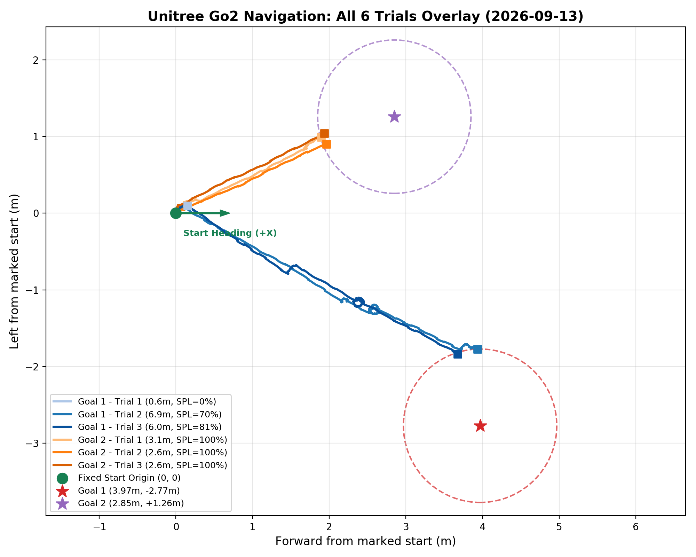
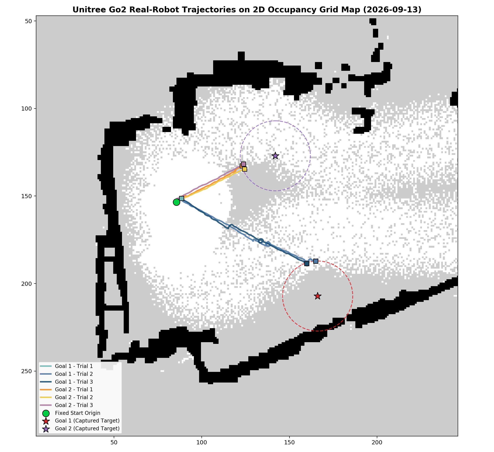
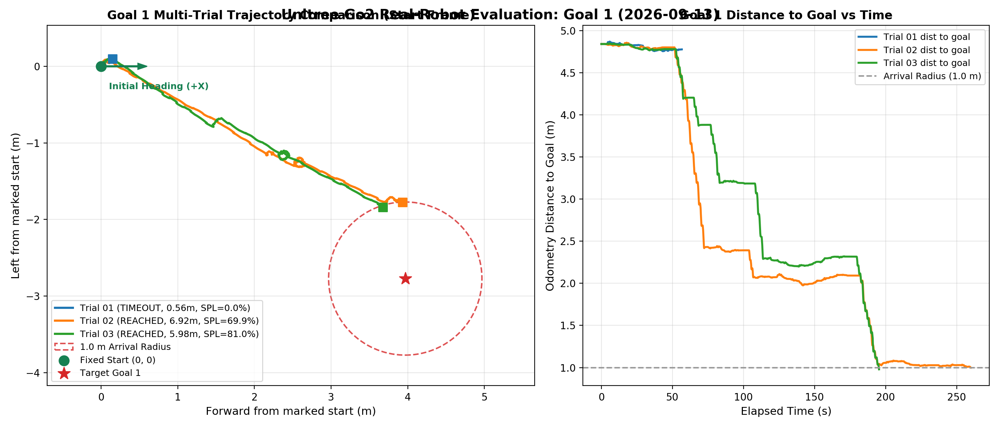
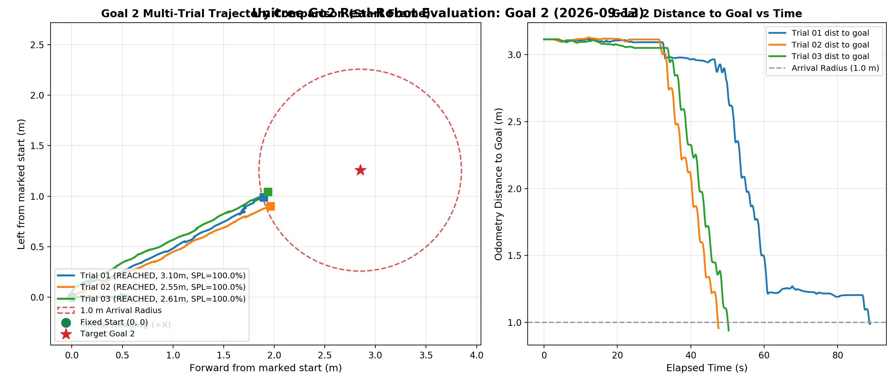

# 2026-09-13 Unitree Go2 실제 로봇 네비게이션 실험 결과 보고서

본 디렉토리는 2026년 9월 13일 Go2 실제 로봇 플랫폼에서 진행된 **Full 비동기 VLM (S2E-VLM) 네비게이션 반복 주행 실험 데이터**를 체계적으로 정리하여 보관합니다.
동일한 고정 시작점(Fixed-Start Origin)에서 **1번 목표(Goal 1)** 및 **2번 목표(Goal 2)**에 대해 각각 3회씩 총 6회 주행을 수행하였으며, 원본 오도메트리 궤적(10Hz 보간 및 고주파 원본), 실행 메타데이터, 개별/통합 시각화 자료를 포함합니다.

> 기록 정정: 표의 잔여 거리·방향값을 원본 `episodes_summary.csv`와 맞췄다. 방향은 제어하지 않지만 오도메트리 오차는 0°가 아니다. 소프트웨어 도착 5/6회와 실측 성공률을 구분하며 SPL 최단 경로는 미확정이다. 지도 위 투영 그림은 live ICP 정확도를 입증하지 않는다.

추가 회차: [어제 지도 2번의 12.53m 목표 주행과 마지막 정체 분석](old_map_goal_2/README.md). 원래 여섯 회차와 목표 집합이 달라 별도로 보존한다.

---

## 1. 실험 환경 및 제어 파라미터

- **프레임워크**: S2E-VLM Full 비동기 정책 (`async_true`)
- **로봇 플랫폼**: Unitree Go2 EDU (Lidar + Front Camera + IMU + Odom)
- **좌표계 방식**: `fixed_start_odometry` (고정 시작점 원점 기준 상대 좌표)
- **도착 판정 반경**: `1.0 m` (자동 거리 도달 시 정지)
- **최종 방향 제어**: 미적용 (PointGoal 도착 거리 기준 정지)
- **Look 동작 정책**: `forward_0p1` (카메라 look down/up 대신 0.1m 미세 전진 대체)
- **최대 주행 허용 시간**: `360 s`
- **목표 위치 (시작점 기준)**:
  - **Goal 1**: 전방 `+3.968 m`, 좌측 `-2.772 m` (직선 거리 `4.841 m`)
  - **Goal 2**: 전방 `+2.849 m`, 좌측 `+1.258 m` (직선 거리 `3.115 m`)

---

## 2. 6회 주행 종합 결과 요약

| 목표 | 회차 | 최종 결과 | 소요 시간(s) | 누적 이동거리(m) | 직선 변위(m) | 최종 목표 잔여거리(m) | 최종 방향 오차(deg) | 현장 관찰 보고 (Field Report) |
|---|---|---|---:|---:|---:|---:|---:|---|
| Goal 1 | 01 | `CONTROLLER_INHIBITED:MOTION_TIMEOUT` | 56.66 | 0.564 | 0.180 | 4.777 | -48.33 | 조작은 없었고, 몸전체가 로봇기준으로 오른쪽 방향으로 약간 회전하고 멈췄어 |
| Goal 1 | 02 | `GOAL_DISTANCE_REACHED` | 259.91 | 6.923 | 4.316 | 0.999 | -172.07 | 약 1m부근에 멈추긴했는데 골포즈를 찍을때 바라보던 방향과 반대 방향처럼 보고 멈췄어. 개입접촉 진로방해는 없었어 |
| Goal 1 | 03 | `GOAL_DISTANCE_REACHED` | 195.35 | 5.979 | 4.110 | 1.000 | -40.37 | 개입접촉없었고 1m부근에 있어 |
| Goal 2 | 01 | `GOAL_DISTANCE_REACHED` | 88.87 | 3.103 | 2.140 | 0.988 | +44.82 | 직접개입 접촉 진로 방해는 없었는데 약 1m안에 들어가자마자 멈춘것 같긴한데 정확히 얼마나 남았는지는 모르겠어. 그래도 육안으로는 약 1m같긴해 |
| Goal 2 | 02 | `GOAL_DISTANCE_REACHED` | 47.54 | 2.551 | 2.159 | 0.961 | +40.94 | 아까 보다 좀 오차가 있어보이는데? 좀 1m보다는 살짝 먼감도 있는데 대충은 맞는것 같아. 개입접촉 진로방해는 없었어. |
| Goal 2 | 03 | `GOAL_DISTANCE_REACHED` | 50.30 | 2.610 | 2.198 | 0.958 | +42.05 | 1m 부근에서 멈췄어. 진로 방해는 없었어. |

---

## 3. 세부 분석 및 고찰

### Goal 1 주행 분석 (직선 거리 4.84m)
- **Trial 1 (`goal-1-001`)**: 시작 직후 초기 관측 회전(Initial observation rotation) 중 시간 초과(`MOTION_TIMEOUT`)가 발생하여 정책 결정 전에 종료되었습니다 (이동거리 0.56m).
- **Trial 2 (`goal-1-002`)**: 성공적으로 1m 도착 반경에 진입하여 자동 정지(`GOAL_DISTANCE_REACHED`, 잔여 0.999m). 소요 시간 259.9s, 누적 이동거리 6.92m. 현장 보고상 골포즈 촬영 시점과 반대 방향(~172도 차이)으로 정지하였으나 PointGoal 거리 조건 충족.
- **Trial 3 (`goal-1-003`)**: 안정적으로 1m 도착 반경에 진입(`GOAL_DISTANCE_REACHED`, 잔여 1.000m). 소요 시간 195.3s, 누적 이동거리 5.98m.

### Goal 2 주행 분석 (직선 거리 3.11m)
- **Trial 1 (`goal-2-001`)**: 안정적 도달 (`GOAL_DISTANCE_REACHED`, 잔여 0.988m). 소요 시간 88.9s, 누적 이동거리 3.10m.
- **Trial 2 (`goal-2-002`)**: 신속 도달 (`GOAL_DISTANCE_REACHED`, 잔여 0.961m). 소요 시간 47.5s, 누적 이동거리 2.55m.
- **Trial 3 (`goal-2-003`)**: 신속 도달 (`GOAL_DISTANCE_REACHED`, 잔여 0.958m). 소요 시간 50.3s, 누적 이동거리 2.61m.
- **Goal 2 종합**: 소프트웨어 도착 조건은 3/3회 충족했다. 평균 소요시간은 62.2초, 누적 오도메트리는 2.75m다. 실제 1m 이내 도착을 측량하지 않았으므로 실측 SR 100% 또는 일반적인 재현성 검증 완료로 해석하지 않는다.

---

## 4. 시각화 결과

### 1) 전체 6회 주행 궤적 통합 오버레이


### 2) 2D Grid 맵 상의 실제 로봇 궤적 투영


### 3) Goal 1 vs Goal 2 개별 비교
| Goal 1 (3회 반복) | Goal 2 (3회 반복) |
|:---:|:---:|
|  |  |

---

## 5. 디렉토리 구조 및 데이터 링크
```
experiments/0913/
├── README.md                     # 본 종합 보고서
├── episodes_summary.csv          # 6회 주행 지표 종합 테이블
├── episode_index.json            # JSON 포맷 상세 지표
├── goal_plan.json                # 골 좌표 및 시작 원점 정의
├── origin.json                   # 원점 오도메트리 스냅샷
├── session_log.md                # 현장 주행 세션 원문 기록
├── visualizations/               # 통합 시각화 플롯
│   ├── all_trajectories_overlay.png
│   ├── goal_1_trajectories.png
│   ├── goal_2_trajectories.png
│   └── trajectories_on_2d_map.png
├── goal_1/
│   ├── trial_01/ (trajectory.csv, raw_odom.csv, trajectory.png, episode.json)
│   ├── trial_02/ (trajectory.csv, raw_odom.csv, trajectory.png, episode.json)
│   └── trial_03/ (trajectory.csv, raw_odom.csv, trajectory.png, episode.json)
└── goal_2/
    ├── trial_01/ (trajectory.csv, raw_odom.csv, trajectory.png, episode.json)
    ├── trial_02/ (trajectory.csv, raw_odom.csv, trajectory.png, episode.json)
    └── trial_03/ (trajectory.csv, raw_odom.csv, trajectory.png, episode.json)
```

- [Goal 1 Trial 1 궤적 데이터](file:///home/unitree/go2_ws_antarctica/experiments/0913/goal_1/trial_01/trajectory.csv)
- [Goal 1 Trial 2 궤적 데이터](file:///home/unitree/go2_ws_antarctica/experiments/0913/goal_1/trial_02/trajectory.csv)
- [Goal 1 Trial 3 궤적 데이터](file:///home/unitree/go2_ws_antarctica/experiments/0913/goal_1/trial_03/trajectory.csv)
- [Goal 2 Trial 1 궤적 데이터](file:///home/unitree/go2_ws_antarctica/experiments/0913/goal_2/trial_01/trajectory.csv)
- [Goal 2 Trial 2 궤적 데이터](file:///home/unitree/go2_ws_antarctica/experiments/0913/goal_2/trial_02/trajectory.csv)
- [Goal 2 Trial 3 궤적 데이터](file:///home/unitree/go2_ws_antarctica/experiments/0913/goal_2/trial_03/trajectory.csv)