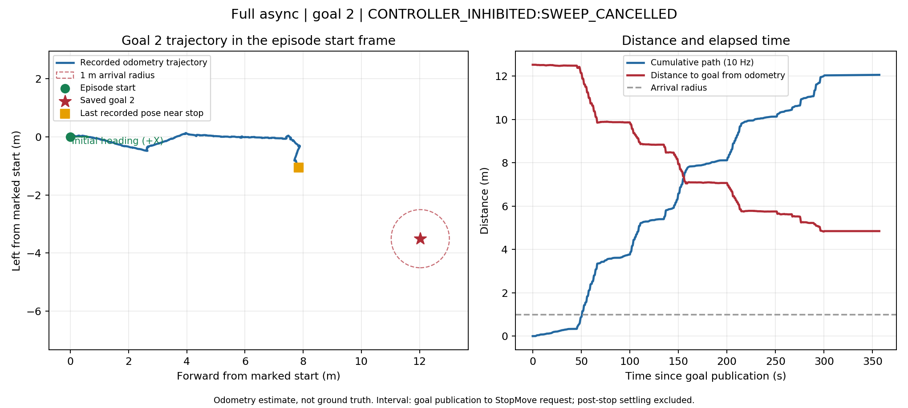

# 어제 지도 2번 목표: 2026-09-13 오후 주행

이번 회차는 앞의 작은 영역 1·2번 반복 주행과 **다른 목표**다. 어제 지도에 저장한 2번으로 주행했지만 도착하지 못했고, 마지막 관측 전환의 시간 초과로 정지했다. 이 디렉터리는 그 원인을 분석하기 위한 수치·상태 전이·행동 로그를 담는다.

## 목표와 좌표

- 원본 지도: `map-reprocessed.db`, SHA256 `b7ad87461b81f2bef1e02a527e35e1976c765c00ff2a98d8f9bd2742f6e437eb`.
- 어제 2번: map XY `(-51.033039, 7.152316)`.
- 사용자가 같은 물리적 시작점과 방향으로 정렬했음을 확인했다. 지도 node 1을 기준으로 회전·평행이동한 목표는 전방 **12.026 m**, 오른쪽 **3.506 m**이며 직선거리는 **12.526 m**다.
- 정지 중 지도 방향이 **22.106°** 흔들려 이번 주행은 `fixed_start_odometry`로 실행했다. ICP 로컬라이제이션 성공이나 측량된 좌표 정확도를 입증하는 실험이 아니다.
- 약 10 m를 목표로 설계했다는 팀원 설명에 비해 직선거리부터 약 25% 길다. 실제 이동 경로는 더 길 수 있지만, 이것만으로 마지막 교착을 설명할 수는 없다.

## 결과

| 항목 | 값 |
|---|---:|
| 에피소드 | `robot-pointnav-29af24bf3e67-1` |
| 주행 시간 | 356.929 s |
| 누적 오도메트리 경로, 10 Hz | 12.060 m |
| 시작점 대비 직선 변위 | 7.911 m |
| 종료 시 목표 잔여 거리 | 4.848 m |
| 도착 반경 | 1.0 m |
| 결과 | `CONTROLLER_INHIBITED:SWEEP_CANCELLED` |

Full `async_true`, 룩 동작 0.1 m 전진 대체, 최종 방향 제어 없음. 주행 중 설정을 바꾸지 않았다. 누적 경로는 제자리 몸체 이동과 오도메트리 잡음을 포함할 수 있으며 실제 전진 거리나 Ground Truth가 아니다. 검토된 최단 경로가 없어 SPL은 비워 뒀다.

현장에서는 **접촉·진로 방해 없이 2번 방향으로 회전한 후 정지**했다고 보고했다. 방향은 맞아 보였고 불필요한 회전이 조금 있었을 수 있다고 했다. 직접 조작 유무는 해당 답변에 별도로 명시되지 않았다.

## 확인된 문제와 남은 재현

1. PixelNav 명령 60개는 모두 실행 완료됐다. 25 cm 전진 23회, `look_down`을 대신한 10 cm 전진 25회, 좌회전 5회, 우회전 7회다. 별도 관측 회전은 이 12회에 포함되지 않는다. **look_up은 이번 회차에서 선택되지 않았다.**
2. 각 전진은 감속·정지 확인 후 완료된다. 연속 전진의 결과 수신→다음 명령 간격 중앙값은 0.263 s다. 이는 동작 안의 감속·정지를 포함한 총 정지시간이 아니다. 짧게 걷다 서는 현상과 비동기 계산의 병행 여부를 구분해야 한다.
3. 마지막 관측 요청은 `pause_requested`에서 90초 동안 `EXECUTOR_PAUSED`와 `CONTROLLER_QUIESCENT` 응답을 받지 못했다. 마지막 회전 완료 후 **56.270초간 다음 행동이 없었다**. 이후 관측 시간 초과가 정지를 유발했다.
4. VLM은 `WAITING_PIXNAV_PREFETCH_APPLY`에 남았고 `PIXNAV_RESULT_DECISION_MISMATCH`도 기록됐다. 네비게이션 HTTP 호출 20회의 중앙값은 2.803 s, 최대 3.053 s, 오류는 0건이었다. 마지막 정체는 단일 HTTP 요청의 장기 지연과 다르다.
5. 우선 재현할 경로는 **첫 행동 결과가 아직 없는 새 결정에서 관측 pause를 수락하는 순서**다. pause 수락 시 action_count=0이었고 이후 행동이 계속 발행됐다. 구체적인 근본 원인과 수정 효과는 별도 검증이 필요하다.

## 분석 파일

- [행동·타이밍](trial_01/action_timing.json), [명령·결과 사건](trial_01/command_result_events.jsonl), [상태 전이](trial_01/status_transitions.json)
- [관측 조정](trial_01/sweep_scheduler_trace.jsonl), [PixelNav 인계](trial_01/pixnav_handoff_trace.jsonl), [VLM 지연](trial_01/vlm_call_timing.jsonl)
- [10 Hz 궤적 CSV](trial_01/trajectory.csv), [원본 오도메트리 CSV](trial_01/raw_odom.csv), [거리 집계](trial_01/distances.json)
- [에피소드](trial_01/episode.json), [현장 보고](trial_01/field_report.json), [좌표 변환](trial_01/coordinate_check.json), [원본 파일 계보](trial_01/source_files.json)
- [원시 센서 기록 해시와 저장 위치](trial_01/native_input_manifest.json), [준비 실패·잘못된 목표 선택의 별도 기록](protocol_deviations.json)

비동기 trace는 수치·문자열 필드를 추출했다. VLM 프롬프트와 응답 본문, 실제 영상은 포함하지 않았다. 약 13 GB의 MCAP 원본은 Jetson에 남겨 두었고 원본별 SHA256을 기록했다. bag은 준비·정지 측정·실패한 시작 검사와 이번 주행을 모두 포함하므로 에피소드 타임스탬프로 잘라 사용해야 한다.

기존 `goal-2-004`는 오늘의 짧은 2번을 잘못 선택했던 회차로 분리했다. 이번 원본 디렉터리의 `old-map-goal-2-002`는 주행 없는 준비 실패 001 다음 번호이며, 이 목표의 두 번째 실제 주행을 뜻하지 않는다. 원래 여섯 회차의 평가에 섞지 않았다.

실행 코드에는 Git 미추적·미커밋 구현이 있어 Git 커밋 하나만으로 실행 환경을 복원할 수 없다. 에피소드의 이미지 ID와 체크포인트 계보 및 원본 소스 해시를 함께 사용해야 한다. 실제 NAV 이미지와 당시 호스트의 `pixnav.py` SHA256은 `d8d46493a8de003ac11f42873c9d0532a815ec6fba7ebd31a49b34a82c447c43`으로 일치했다.
