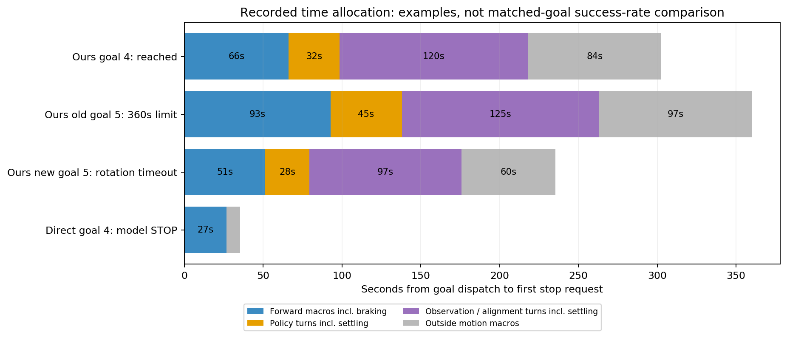
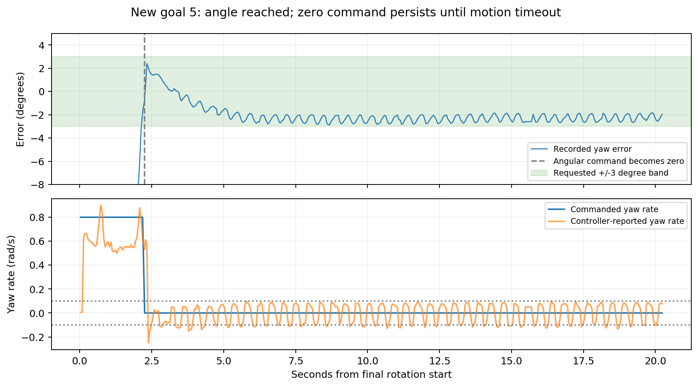

# 주행 속도·5번 목표·추가 실패 경로 검증

2026-09-14. 실제 24개 에피소드의 1,121개 동작 종료 기록과 배포된 코드의 격리 시험을 분석했다. 이번 작업에서는 원본 로그를 삭제하거나 로봇 주행·속도·기록 설정을 바꾸지 않았다. **확인한 결함이 남아 있으므로 ‘모두 검증됐고 실주행만 남았다’는 결론이 아니다.**

## 가장 먼저 처리할 세 가지

1. **회전 완료 판정**: 새 5번은 목표 각도에 들어온 뒤 작은 진동 때문에 정지 확인을 통과하지 못했다. 배포된 코드에 당시 각도/각속도를 재생하면 같은 시간초과가 재현된다.
2. **제어 통신 대기와 센서 처리의 경합**: 새 센서가 계속 들어와도 동기 명령 응답이 제어 주기보다 길어지면 처리되지 않아 stale 종료가 난다. 격리된 실제 ROS 콜백에서 반복 재현했다. 콜백 그룹만 나누거나 주기를 조금 늦추는 조치는 일부 조건에서 다시 실패했다.
3. **Direct 정책 세션의 300초 제한**: 앞선 작업의 1800초 변경은 전체 에피소드/기록 상한이었다. 단일 Direct 정책 세션에는 별도로 300초 유효기간이 남아 있다. 새 영상·pose를 줘도 301초에 `LOCAL_POLICY_EXPIRED`가 발생했다. 향후 긴 비교에서는 이를 먼저 정리해야 한다.

위 3번은 추가 검사로 찾은 제한이다. 어제 Direct 5회는 27~71초에 모델 STOP으로 종료했으므로 그 실패의 원인을 300초 제한으로 바꾸지 않는다.

## 1. 일반 전진과 전체 주행 속도

현재 전진 명령 상한은 0.5m/s, 회전 명령 상한/하한은 0.8rad/s다. **0.5m/s 정속으로 계속 걷는 구조는 아니다.** 20/25cm 동작마다 가속→감속→정지 확인→새 관측·추론이 반복된다. 0.5m/s 이상으로 올리기 전에 짧은 동작의 정지 비용과 회전 대기 시간을 줄일 필요가 있다.

look 20cm·회전 0.8 설정이 같은 회차의 성공적으로 끝난 개별 동작을 집계했다. 에피소드 전체 성공만 선택한 것이 아니며, 실패 에피소드 안의 완료 동작도 포함한다.

| 동작 | 검사 수 | 한 번 완료 시간 중앙값 / 95백분위 | 동작 거리÷완료시간 중앙값 |
|---|---:|---:|---:|
| 일반 25cm 전진 | 216 | 1.40초 / 1.53초 | 0.187m/s |
| look 대신 20cm 전진 | 178 | 1.27초 / 1.46초 | 0.168m/s |
| 정책 30° 회전 | 106 | 2.90초 / 6.75초 | 0.171rad/s |
| 관측·목표 정렬 회전, 각도 다양 | 167 | 3.13초 / 8.95초 | 각도가 달라 동일 30° 기준으로 비교하지 않음 |

전진 명령이 0이 아닌 구간의 odom twist를 가까운 시각(75ms 이내)으로 대조했을 때, 각 동작별 속도 중앙값들을 다시 집계한 중앙값은 일반 전진 0.261m/s, look 전진 0.233m/s였다. 이 값도 가감속을 포함한다. 외부 실측 정속/다리 캘리브레이션 측정치가 아니다.

394개 전진 동작의 nonzero 명령 구간 약 395.7초 중 0.49m/s 이상을 명령한 시간은 약 57.7초(14.6%)였다. 따라서 설정 숫자 0.5만으로 체감 속도를 설명할 수 없다. 1m/s² 가속 한도와 짧은 이동거리에서는 가감속 구간 비중이 크다.

| 대표 회차 | 전체 시간 | 전진 동작(감속 포함) | 정책 회전 | 관측·정렬 회전 | 동작 밖 시간 |
|---|---:|---:|---:|---:|---:|
| Ours 4번 성공 `original5/4-009` | 302.35초 | 66.23초 | 32.14초 | 119.78초 | 84.20초 |
| 이전 장거리 5번 `long5/5-001` | 360.02초 | 92.68초 | 45.29초 | 125.23초 | 96.82초 |
| 새 5번 `recaptured5/5-001` | 235.50초 | 51.36초 | 27.94초 | 96.59초 | 59.60초 |
| Direct 4번 `recaptured5/4-002` | 35.40초 | 26.69초 | 0 | 0 | 8.70초 |

Ours 4번의 약 152초 회전 구간 중 **97.54초는 각속도 명령이 0인 완료 대기 구간**이었다. 이 구간에는 몸체가 멈추는 과정도 포함되므로 실제 로봇이 97.54초 완전히 정지했다고 해석하지 않는다. 새 5번도 회전 중 0 명령 대기가 약 81.92초다. 단순히 회전 상한을 더 높이는 것보다 완료 대기·회전 횟수 개선이 우선이다.

Ours 4번은 오도메트리 추정 경로 14.97m에 302.35초, 경로/전체시간 약 0.050m/s였다. 새 5번도 약 0.052m/s다. 실제 전진 구간의 속도와 다르다. 기록용 에피소드 진행은 가능했던 속도지만, 효율적인 연속 주행으로 충분히 최적화됐다고 평가하기 어렵다. 수동 이동이 포함된 마지막 Ours 4번의 경로 속도는 자율 성능 집계에서 제외해야 한다.

자료: [에피소드별 CSV](episodes.csv), [1,121개 동작 CSV](macros.csv), [집계·방법·입력 해시](results.json). `other_time`은 VLM만의 대기가 아니라 입력 획득·정책 추론·결정 교체·관측 간격·콜백 대기 등이 섞인 구간이다. 추정한 macro 구간들의 겹침도 검사했다.

## 2. 비동기는 실제로 동작했는가

네트워크 요청 완료시각에서 latency를 빼 요청 구간을 복원하고, 겹치는 요청은 합집합으로 처리했다. 초 단위 완료 UTC 때문에 약 1초의 정밀도 제한이 있다.

- Ours 4번 성공: navigation VLM 21회의 중앙값 약 **2.69초**, 전체 VLM/검사 요청 131회 오류 0건. nonzero 전진 명령 구간과 HTTP 대기가 약 **25.6초** 겹친다.
- 새 5번: navigation VLM 16회의 중앙값 약 **2.82초**, 전체 요청 100회 오류 0건. nonzero 전진과 HTTP 대기가 약 **21.3초** 겹친다.
- 따라서 VLM이 끝날 때까지 모든 움직임을 직렬로 기다리는 상태는 아니었다. 하지만 비동기가 켜져도 각 동작의 정지 확인, 관측 회전, 비추종 가능 후보의 폐기/재계획 비용은 사라지지 않는다.
- 0.6초 부근의 전체 HTTP 중앙값은 짧은 후보/점 검사 요청이 많이 포함된 값이다. 주요 navigation 결정을 0.6초에 얻었다고 보고하면 안 된다.
- 이전 마지막 Ours 4번의 Wi-Fi 단절/30초 연속 timeout은 별도 통신 장애다. 이번 정상 5번은 VLM 오류가 없으므로 같은 원인으로 묶지 않는다.

HTTP와 움직임이 겹친 시간은 비동기 중첩의 근거다. HTTP가 있던 모든 정지 시간의 인과 원인이 VLM이었다거나, 최적의 비동기 시간 배치라고 입증한 것은 아니다.

## 3. 새 5번은 왜 종료됐는가

현재 새 목표는 fixed-start 좌표 **(14.443445, -6.559551)m**, 직선거리 **15.863m**다. `recaptured5/full-goal-5-001`은 약 235.50초에 7.690m를 남기고 회전 `MOTION_TIMEOUT`으로 끝났다. 전진 39회·회전 30회 중 마지막 회전만 실패했고, 그 전 68개 동작은 완료로 기록됐다.

마지막 관측/정렬 회전은 +72.976° 요청이었다. **2.253초에 약 72.293°가 측정되며 회전 명령은 0으로 바뀌었고, 그 뒤 약 18초를 기다렸다.** 20.296초 종료 때 잔여 오차는 약 1.839°였다. 목표각을 크게 못 돌아서 끝난 사례가 아니다.

현재 완료 조건에는 각도 허용 범위와 별도로 0.35초의 연속 정지 관측, 각도 변화폭 0.25° 이하, 낮은 이동속도/각속도가 있다. 실제 기록의 작은 반복 각도 변화는 이 조건을 만족하지 못했다.

배포 이미지 안의 변경하지 않은 `MeasuredMotion`에 당시 405개 각도/각속도 샘플을 재생했다. 선속도는 기록되지 않은 제어기 내부 값을 대신해 낙관적으로 0으로 두었다. **이 가정에서도 각속도 명령 405개가 기록과 일치하고 같은 `MOTION_TIMEOUT`이 발생**했다. 즉 각도 관련 조건만으로도 실패가 설명된다. 전체 실제 odom/선속도까지 완전하게 복원한 replay는 아니다.

메모리 안의 복사본에서 안정화 판정 민감도를 비교했다. 0.25° 또는 0.5° 변화폭 조건에서는 검사 조합들이 여전히 실패했다. 1° 변화폭에서는 기존 0.1rad/s 정지 각속도 기준일 때 약 11.94초, 0.15rad/s일 때 약 2.83초에 판정 가능했다. 그러나 선속도가 0.08m/s인 조건은 계속 거부됐다. **1°/0.15가 검증된 실로봇 최적값이라는 뜻은 아니다.** 센서 진동과 실제 몸체 회복을 구분하고, 늦은 recoil·미끄러짐·정지 후 자세를 확인해야 한다. 상한/검사를 통째로 없애는 방식은 검증하지 않았다.

자료: [설치 코드 재생·민감도](settling_replay.json), [재생 코드](replay_settling.py).

이전 `long5/5-001`은 다른 목표 좌표에서 1.513m를 남기고 전체 360초 제한으로 종료한 사례다. 새 5번의 회전 실패와 구분한다. **1800초 연장은 새 5번의 개별 회전 실패를 해결하지 않는다.**

## 4. 새 5번 좌표도 추가 확인했다

저장 시 odom→fixed-start 변환과 주행 발송 시 fixed-start→당시 odom 변환을 각각 다시 계산했다. 두 계산 모두 저장/발송된 값과 부동소수점 비교에서 오차 0이었다. 따라서 이 회차에서 단순 좌우 부호 반전이나 옛 5번 좌표 오발송은 찾지 못했다.

그러나 캡처 후 물리적으로 시작점에 돌아왔다고 보고한 시점에 odom은 **0.468m·5.43°** 차이가 있었다. 실제 재배치 오차와 오도메트리 drift를 분리할 외부 기준이 없다. 약 15.86m 목표에서는 출발 방향이 1° 다르면 약 0.277m, 3°면 0.830m, 5°면 1.383m의 횡방향 오차가 생긴다. 이는 민감도 계산이며 당시 실제 오차가 꼭 5°였다는 주장이 아니다.

표시한 시작점에서 재앵커하는 방식은 좌표 연속성이 끊기는 문제를 줄이지만, 실제 배치 방향·장거리 drift를 자동 보정하지 않는다. 현재 방법을 ICP 전역 정합이 검증된 localization이나 실측 Ground Truth라고 부르면 안 된다. 장거리 성공 반경 1m 평가에서는 시작 위치/방향과 실제 도착 위치의 외부 확인이 필요하다.

자료: [좌표 대조·폐합·방향 민감도](goal5_geometry.json).

## 5. 센서가 와도 제어기는 stale을 낼 수 있는가

실제 배포 `ActionExecutorNode`, ROS 3-thread executor, 30Hz의 합성 odom/pose/영상 헤더, 기록용 가짜 Sport transport로 시험했다. 네트워크는 컨테이너 내부 loopback뿐이고 물리 API는 호출하지 않았다. 동일 프로세스의 독립 구독자도 최신 pose를 기록한다.

| 명령 응답 지연 | 제어 주기 | 구성 | 관측 결과 |
|---|---:|---|---|
| 0 / 20ms | 20Hz | 배포 코드 | 각 8초 동안 stale 없음 |
| 80ms | 20Hz | 배포 코드 | 초기+반복 3회 모두 약 0.56초 후 `ODOM_STALE` |
| 80ms | 20Hz | 센서 callback group만 분리한 시험 subclass | 2회 모두 `LOCALIZED_POSE_STALE` |
| 95ms | 20Hz | 같은 subclass | `LOCALIZED_POSE_STALE` |
| 80ms | 10Hz | 배포 구조 / 센서 group 분리 | 각 8초 동안 stale 없음 |
| 95ms | 10Hz | 센서 group 분리 | 다시 `LOCALIZED_POSE_STALE` |

실패 순간 실행기의 pose age는 약 0.52초였고 독립 구독자의 최신 pose age는 약 0.016~0.040초였다. **센서 발행 중단 없이 제어 처리 경합만으로 freshness 종료가 나는 경로가 재현됐다.** 동기 통신을 공용 잠금 안에서 기다리는 구조이며, 대기가 timer 간격을 거의 다 쓰거나 넘으면 수신 처리가 밀린다. 콜백 그룹만 나누면 잠금 경합이 남고, 제어 주기를 10Hz로 늦추면 더 긴 응답 지연에서 다시 실패했다.

따라서 필요한 수정 방향은 최신 센서 처리와 blocking transport를 분리하고, 정지/취소/세대 교체가 이전 Move를 재실행하지 못하게 명령 순서와 소유권을 함께 보장하는 것이다. 응답 전에 ‘전달 성공’으로 처리하거나 오래된 명령을 큐에 쌓는 대체도 적절하지 않다.

이 시험은 어제 `LOCALIZED_POSE_STALE`의 **가능한 실패 경로를 구체적으로 재현**한 것이다. 당시 실제 왕복 지연·제어기 내부 보유 stamp는 기록되지 않았으므로 같은 원인이었다고 확정하지 않는다. 단순 timer 지연 시험이며 GPU/VLM/전체 bag의 동시 부하나 실제 네트워크 transport 검증을 대체하지 않는다. ROS 테스트 종료 단계에서 queued callback destroy 경고가 나온 로그도 보존했고, 위 실패는 종료 정리 이전의 활성 구간에서 측정했다.

자료: [첫 시험](callback_delay_initial.json), [반복·group 분리 비교](callback_delay_group_comparison.json), [10Hz 비교](callback_delay_results.json). 이 subclass와 10Hz 변경은 시험 컨테이너 안에서만 사용했다.

## 6. Direct PixelNav와 1800초 평가 조건

앞서 실제 5회·118개 정책 출력을 ESCAPE 기준 원본/논문 저자 코드와 대조해 선택 행동이 동일함을 확인했다. 좌우 명령 반전도 기록에서 발견되지 않았다. 이번에 같은 계산을 불필요하게 다시 돌리지는 않았다. [PixelNav 원본 대조 결과](../pixnav_direction_review/README.md).

- 실제 Direct 기록 5회는 모두 **4번 목표**다. 새 5번 Direct 실주행은 아직 없다.
- 입력은 가려진 최종 좌표를 첫 영상에 투영한 픽셀과 고정 목표 이미지다. 벽 뒤 최종 목적지와 앞에 보이는 벽 표면을 픽셀 하나로 구별할 수 없다.
- 모델 자체의 STOP이며 360초 제한이나 look 차단에 의한 정지는 아니었다. 동일 Go2 어댑터를 쓰는 **Direct-goal PixelNav**의 조건부 실패 사례로 쓸 수 있다.
- 순정 모델 전체가 잘못 학습됐다거나, 모든 가시 목표에서도 실패한다고 확대할 수 없다. 눈에 보이는 같은 목표의 Direct 비교가 추가로 필요하다.

장시간 한도를 더 검사하자 `PixNavRuntimeNode`가 `PIXNAV_LOCAL_POLICY_TTL_MS`를 지정하지 않으면 **300,000ms**로 초기화하고, Direct launcher가 500 step만 변경하는 것을 확인했다. 1800초로 준비한 파일에도 이 TTL override가 없다. 실제 설치된 node에 가짜 정책을 붙여 새 영상/pose를 공급했을 때:

| 첫 정책 실행을 시도한 시각 | 실제 runtime TTL | 결과 |
|---|---:|---|
| 세션 승인 후 299초 | 300초 | 정책 전진 출력 |
| 301초 | 300초 | 추론 호출 전 `LOCAL_POLICY_EXPIRED` |
| 1799초 | 300초 | 추론 호출 전 `LOCAL_POLICY_EXPIRED` |

이 시험은 세션 수명 경로를 분리하기 위해 새 입력을 유지하고 첫 정책 step 시각만 이동했다. Direct는 하나의 고정 세션을 쓰므로 긴 실행에서 영향을 받는다. Full은 중간 목표가 교체될 때 지역 세션이 다시 만들어져 같은 제한의 효과가 다르다. 전체 1800초와 별개인 정책 세션 제한을 정리하되 모델 STOP·step 제한·sensor/command timeout은 서로 다른 의미로 유지하고 비교 조건에 명시해야 한다. [재현 결과](direct_lifetime.json)

## 7. 전진과 회전을 동시에 해야 하는가

최신 canonical `main`은 조회 시 원격과 로컬 모두 `fc336569a9a521ecd395925f41014bbcc9265c26`였다. 해당 Habitat worker는 `move_forward`, `turn_left/right`를 별도 step으로 실행하고, 기본 전진 0.25m·회전 30°를 설정한다. 따라서 **큰 회전을 전진과 나누는 방식 자체는 현재 정책 행동 체계와 맞는다.** 비동기는 VLM 계획과 정책 실행의 시간 중첩이며, 선속도와 각속도를 반드시 동시에 명령해야 한다는 뜻은 아니다.

Go2 API는 `Move(vx, vy, vyaw)`로 선속도·회전속도를 함께 전달할 수 있다. [공식 Unitree 코드](https://github.com/unitreerobotics/unitree_sdk2_python/blob/master/unitree_sdk2py/go2/sport/sport_client.py).

실제 로봇 구현도 일반 전진 동안 heading 오차에 비례한 최대 ±0.25rad/s 보정을 이미 함께 보낸다. 검사한 394개 전진 동작의 nonzero tick 7,917개 중 6,820개에는 0.01rad/s보다 큰 방향 보정 명령이 있었다. 설치 코드에 +5° heading 오차를 넣어 전진 +0.1m/s와 반대 방향 보정 -0.105rad/s가 함께 나가는 것도 확인했다.

정책의 30° 회전을 곡선 이동으로 바꾸는 것은 다른 변경이다. 같은 다음 관측에서도 위치·시야·이동 경로가 달라져 원본 정책 이력 및 Ours/Direct 공정 비교에 영향을 준다. 가능한 개선 후보지만 지금 관측된 회전 완료 대기와 센서 처리 문제의 선행 해결책으로 확정할 근거는 없다. 별도 제어/정책 비교 실험으로 검증해야 한다.

## 8. 추가로 실행한 실패 경로 검사

배포 navigation 이미지 `8a36ebd…`의 설치된 코드로 시험했다. motion/executor/sport_client/PixelNav/VLM/sweep runtime 6개 모듈은 호스트 소스와 해시가 같았다.

- 로봇 동작/입출력 경계: **329개 사례 통과**. 센서 지연·정지·취소·늦은 명령·태스크 교체·측정 완료·좌표계·영상 시각 등을 포함한다.
- 비동기/정책 경계: **331개 사례 통과**. look 5/10/20cm 변환, 실제 완료와 새 영상 이후 다음 step, 지나친/만료된 다음 목표 거부, 외부 중단 뒤 늦은 ACK 차단, sweep 실패, Direct graph 및 HTTP 처리 등을 포함한다.
- 실제 Unix socket과 기록용 publisher를 쓰는 명령 transport: **71개 사례 통과**. 실제 배포 Foxy server와 현재 Jazzy client의 동일 소스 조합으로 float32 속도 경계, 중복/만료 명령, 세션 재시작, watchdog, 신호 종료를 검사했다. 로봇 DDS로 발행하지 않았다.

총 731개는 위 서로 다른 test case 수이며 앞선 1800초 시험을 더해 부풀리지 않았다. 처음 실행의 mount 누락 1건, 테스트 전용 domain/config 누락으로 인한 Direct 10건, Foxy 이미지 안의 오래된 비사용 client로 검사한 23건 실패도 기록에 남겼다. 각각 필요한 config를 제공하고, Direct는 214 domain과 camera 계약을 제공하고, wire 검사는 실제 사용하는 현재 client 소스를 읽기 전용으로 가져와 해당 사례를 다시 통과했다. 테스트 실패를 생산 코드 수정으로 숨기거나 기존 로그를 덮어쓰지 않았다.

**731개 통과와 위에서 재현한 두 고장은 양립한다.** 기존 사례에 반복 미세 진동과 제어 주기보다 긴 blocking transport의 지속 부하가 충분히 포함되지 않았기 때문이다. 이번 추가 재현이 그 공백을 드러냈다. 전체 실로봇 성능/충돌 회피/다리 안정성에 대한 PASS가 아니다.

또 실제 sidecar 원문에 `invalid data size`, `string data is not null-terminated`가 있는 것을 확인했다. 성공한 Ours 4번에도 나오므로 특정 실패의 원인으로 단정하지 않는다. 원문에는 해당 topic/정확한 시각이 없어 영향 경로가 아직 분리되지 않았다. 다음 transport 계측에서 수신 토픽·메시지 타입과 함께 추적할 항목이다.

## 적용 전후에 남은 검증 순서

1. 회전 완료 판정을 실제 정지/진동에 맞게 설계하고, 이번 5번뿐 아니라 기존 recoil·미끄러짐·stale·취소 사례까지 함께 통과하는지 확인한다.
2. 제어 I/O와 센서 처리 경합을 제거한 후보에서 80/95ms 지연을 포함해 반복 시험한다. 정지의 우선권, 이전 세대 Move 재전송 차단, 실제 응답과 결과 ACK 시각을 함께 검증한다.
3. Direct 지역 세션 300초와 전체 1800초의 불일치를 수정·검증한다. 기존 360초/모델 STOP 결과는 그대로 둔다.
4. 현재 전체 raw 기록의 공간 소모를 정리한다. 경량 기록은 아직 적용되지 않았으며 1800초 여러 회차를 연속 기록할 충분한 디스크 여유가 있는 상황은 아니다. [저장공간 검토](../storage_review/README.md).
5. 본체에서는 수정된 회전 완료 후 자세/재출발, 실제 Sport 지연, 표시 시작점 방향과 5번 현장 도착 오차를 확인한다. 이후 동일 조건 Ours/Direct 에피소드로 SR/SPL 자료를 모은다. 외부 최단 경로 기준과 현장 개입 기록도 필요하다.

지금 전진·회전 상한만 더 올리거나 곡선 주행을 바로 섞으면 위 원인이 남은 채 동작 조건이 추가로 바뀐다. 검증 우선순위는 **완료 대기·센서 처리 경합·장시간 제한 정합**이다.

## 재현 자료

`audit_timing.py`, `replay_settling.py`, `probe_callback_delay*.py`, `check_direct_lifetime.py`, `run_boundary_checks.py`, CSV/JSON/JUnit/원문 로그를 함께 보존했다. `source_reference/`는 canonical main 행동 코드와 현재 motion/executor/client 사본이고, 원본 위치와 해시는 [source_provenance.json](source_provenance.json)에 있다. `make_figures.py`는 이 묶음과 앞선 야간 분석의 작은 motion JSON으로 그림을 다시 만든다.

검사는 `--network none --read-only --cap-drop ALL --security-opt no-new-privileges --user 1000:1000` 컨테이너에서 수행했다. ROS는 격리된 loopback domain 224, Direct graph/transport는 테스트가 요구하는 214를 사용했다. 원본/설정은 읽기 전용 mount, `/out`만 이 보고서 폴더로 쓰기 허용했다. 임시 ROS 로그는 `/tmp`에 기록했다. 프로덕션 소스·이미지·실행 대기 회차는 변경하지 않았다. 커밋/푸시는 하지 않았다.
