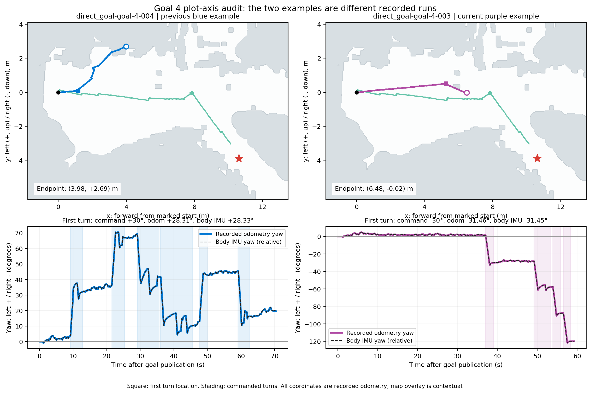

# Goal 4 PixelNav 궤적 y축 반전 의심 확인

**확인한 로그에서는 PixelNav만 y축이 뒤집혔다는 근거가 없다.** 기존 파란색은 `004`, 새 보라색은 `003`으로 서로 다른 회차다. 004는 초반에 좌회전하여 지도 위쪽으로 진행했고, 003은 더 전진한 뒤 우회전하여 아래쪽으로 진행했다.

| 확인 | 이전 파란색 004 | 현재 보라색 003 |
|---|---:|---:|
| 첫 회전 명령 | 좌회전 +30° | 우회전 −30° |
| 첫 회전 오도메트리 | +28.31° | −31.46° |
| 같은 구간 본체 IMU | +28.33° | −31.45° |
| 같은 구간 본체 gyro 적분 | +27.65° | −31.56° |
| 최종 좌표 (x, y), m | (3.978, +2.694) | (6.475, −0.023) |

004의 두 번째 회전도 좌회전이며 odom +30.63°, 본체 IMU +30.62°다. 두 회차의 회전 총 10개 모두 정책 행동·실행 명령·odom·본체 IMU 변화·gyro 적분의 부호가 일치한다. 명령 구간 경계와 본체 기록의 시각 대응 오차는 11ms 이내다.

003의 첫 회전 직전 위치는 약 `(5.244, +0.508)m`이고 종료는 `(6.475, −0.023)m`이므로, 꺾인 이후 실제 기록의 y값은 감소한다. 새 그림에서도 이 구간은 아래쪽을 향한다. 이후 제자리 회전까지 있어 최종 자세 방향과 이동 궤적 끝부분의 방향을 혼동하지 않아야 한다.

## 좌표 확인 범위

- Ours와 PixelNav 모두 같은 시작점 변환 `x=c*dx+s*dy`, `y=-s*dx+c*dy`를 사용한다. 이 회전행렬의 행렬식은 +1이며 반사 변환이 아니다.
- 이미지 행 좌표는 기존 지도와 동일한 `(max_y-y)/resolution`이다. 따라서 +y는 지도 위쪽이고, 시작 전방이 화면 오른쪽인 이 배치에서 로봇의 좌측에 해당한다. −y는 로봇 우측이며 지도 아래쪽이다.
- 두 회차의 모든 원본 odom 이벤트를 다시 변환하여 그림 CSV와 대조했고 좌표·시간 차이는 0이다. `audit.json`에 표본 수와 오차가 있다.
- 단순히 파란색 선만 y 부호를 반대로 만들면 기록된 좌회전·본체 회전 방향과 일치하지 않게 된다. 이번 확인으로 궤적이나 기존 그림을 반전 수정하지 않았다.
- 본체 IMU는 회전 부호를 뒷받침하는 별도 기록이다. 절대 지도 정합이나 외부 Ground Truth 위치까지 검증한 것은 아니다. 각 회차의 현장 미확인 상태는 기존 기록 그대로 유지한다.

## 팀 공유용

> 파란색은 이전 004 회차인데, 로그를 다시 보니 실제로 좌회전 명령이 나갔고 본체 IMU도 같은 좌회전을 기록했습니다. 따라서 그래프 y축만 뒤집힌 것으로 보이지는 않습니다. 새 보라색 003은 더 멀리 전진한 뒤 우회전한 다른 회차이며, 이 궤적은 말씀하신 아래쪽으로 꺾입니다.

실행: 저장소 루트에서 `python3 experiments/0914/goal4_plot_axis_audit/audit_axes.py`.
기존 자료만 읽으며 로봇·주행 설정은 바꾸지 않는다. 입력 및 산출물 해시는 함께 보존했다.
