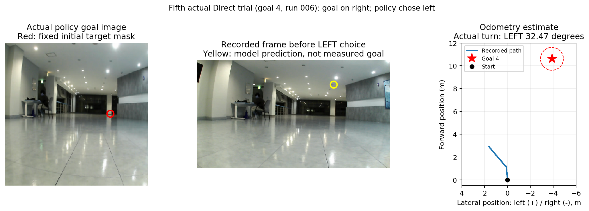

# PixelNav 반대 방향 주행 확인 — 2026-09-14

**어젯밤 확인한 회차에서는 좌우 명령 반전이나 추론 코드 이식 오류로 다른 행동이
나왔다는 근거를 찾지 못했다. 같은 입력을 원본에 재생해도 같은 행동이 나온다.
그러나 이 결과를 ‘실로봇 구현 전체가 올바르며 순정 PixelNav의 학습만 잘못됐다’는
결론으로 확대할 수는 없다. 가려진 최종 목표를 영상의 픽셀로 전달하는 방식과
look→20cm 전진 대체가 원래 정책의 사용 조건과 다르다.**

## 조사한 회차

현재 캠페인 `recording-five-goals-recaptured5-20260914`의 실제 PixelNav 주행은
**4번 목표에 대한 5회**다. `direct_goal-goal-4-002`부터 `-006`까지이며,
`-001`은 주행 시작 전 실패다. 이 캠페인에 Direct **5번 목표** 주행 기록은 없다.
아래에서는 사용자의 ‘5번 주행’을 마지막 5번째 실제 회차까지 포함한 질문으로
해석해 5회를 모두 검사했다.

| 회차 | 실제 전진/회전 동작 수 | 그중 회전 | 종료 시 추정 남은 거리 |
|---|---:|---:|---:|
| 4-002 | 20 | 0 | 7.46m |
| 4-003 | 30 | 4 | 5.66m |
| 4-004 | 28 | 6 | 9.35m |
| 4-005 | 20 | 8 | 8.79m |
| 4-006 | 15 | 1 | 9.47m |

목표는 시작 좌표계에서 `(10.613861, -3.886406)m`, 직선거리 약 11.30m다.
좌표는 오도메트리 기준이며 외부 실측 Ground Truth가 아니다.
개입·접촉·진로 방해가 모두 없었다는 현장 확인은 4-002에만 확보되어 있다.
나머지 네 회차의 현장 조건은 미확인으로 유지한다.

## 마지막 회차에서 실제 일어난 일

1. 목표는 시작 방향 기준 오른쪽 약 20.1°에 있고, 초기 원본 영상의
   `(433,179)` 픽셀에 표시됐다. 실제 224×224 정책 입력에서도 오른쪽이다.
   앞서 Full 관측 회전의 방향을 잘못 물려받는 preturn은 **0°**였다.
2. look_down 2번은 각각 20cm 전진으로 실행되고, 일반 전진 3번이 이어졌다.
3. 6번째 정책 출력, `step_index=5`에서 목표 방향은 당시 추정 자세 기준
   **오른쪽 25.36°**였지만 모델의 최고 logit은 **좌회전**이었다.
   좌회전 2.927866, 전진 1.703714, 우회전 -1.496427이다. raw/effective logits가 같다.
4. 실행기는 좌회전 +30°를 요청했고 오도메트리로 **왼쪽 32.47°**, 2.00초가
   측정됐다. 목표가 오른쪽이라는 이유로 실행기가 우회전으로 바꾸지는 않는다.
5. 이후 정책은 전진을 계속 선택했다. 종료 좌표는 약 `(2.92, +1.63)m`,
   시작 대비 방향은 왼쪽 39.76°였다. 마지막 출력은 모델 STOP이며 목표는 9.47m 남았다.

이 회차는 ‘180° 반대로 명령했다’기보다 **오른쪽 목표에 대해 왼쪽 경로로 벗어난
사례**로 기록하는 것이 정확하다. 이 수치는 오도메트리 관측이다.
다른 회차에서는 우회전이 여러 번 누적되기도 했다. 4-003은 4회의 우회전 후
시작 대비 약 -119.88°로 종료했으며 이것도 모델이 선택한 우회전과 일치한다.

전체 113개의 실행 완료 동작을 정책 step 번호와 연결했다. 전진 94회와
회전 19회 모두 명령 종류·부호가 일치하고 완료 상태는 OK였다.
look은 20cm 전진, 일반 전진은 25cm, 좌회전은 +30°, 우회전은 -30°로
실행됐다. 이는 **검사한 로그에서의 일치**이며 모든 실로봇 제어 조건의 검증은 아니다.
자료: [단계별 CSV](actions.csv), [상세 대조](direction_results.json).



가운데 노란 표시는 모델이 예측한 목표 위치다. 실제 측정 목표가 아니다.
좌회전을 선택할 때 이 표시는 천장 쪽으로 벗어나 있었다. 목표 추정의 불안정을
시사하지만, 이 표시 하나만으로 해당 행동의 내부 원인을 확정하지 않는다.

## 실제 기록을 원본 정책에 재생한 결과

Jetson GPU에서 실제 주행 때 사용한 이미지
`sha256:e6822ef03f0250d16fa6becf16be637faac01e0e35a7a24a1c184c9557899b6f`의
설치된 native 정책을 실행했다. 생산 소스를 새 코드로 덮어쓰지 않았다.
체크포인트 A의 SHA-256은
`0b1faff7631962351bbbfe8cb115a3a03069f33fab499865f887ffbb5a3cabe3`다.

원본 소스 4개 파일은 앞서 보관한 해시와 대조했고 변경 없이 import했다.
두 원본과 native 네트워크의 state tensor가 동일한 것도 확인했다.

| 비교 대상 | 비교한 정책 출력 | 행동 불일치 | native와 raw 출력 수치 비교 |
|---|---:|---:|---|
| ESCAPE 이식 기준 원본 `5d890445...` | 118 | **0** | 세 head 모두 정확히 동일 |
| 논문 저자 원본 `f7077a4c...` | 118 | **0** | 엄격한 1e-5 기준에는 불일치 |

현재 native와 당시 기록은 118개 모두 행동과 수치 허용오차 검사에 일치했다.
논문 저자 원본은 logits 최대 차이 0.00771785, distance head 0.00112057,
goal head 0.000234187이다. 원본의 전체 64칸 이력 처리와 native의 관측된
이력 길이 처리를 그대로 유지했다. **공식 원본과 비트 단위 수치 동등성은
주장하지 않는다.** 마지막 좌회전과 다섯 회차의 최종 STOP도 양쪽 원본에서
동일하게 선택됐다. 종료 코드 0은 행동 일치 검사 결과이며,
`strict_numeric_parity=false`는 그대로 보존했다.

원본에도 로봇에서 사용하는 calibrated_4_3 변환을 먼저 적용한 뒤 자체 전처리를
실행했다. 저장된 목표 이미지·마스크, 각 시점의 관측 영상·이력 tensor의
일치를 확인했다. 따라서 이는 **동일한 로봇 입력 조건에서 정책 이식의 동등성**을
검사한 것이며, 카메라 보정의 절대 정확성이나 그 변환의 성능을 입증하지 않는다.
look을 실제 카메라 기울임으로 수행한 가상의 이후 영상을 재현한 것도 아니다.

총 실행 72.42초. ROS 노드·VLM 요청·로봇 명령 0회, 네트워크 차단 상태의
오프라인 추론이다. [전체 재생 결과](replay_results.json), [실행 기록](replay.log).

## 오른쪽 픽셀을 찍으면 왜 오른쪽으로 곧장 가지 않는가

정책은 목표 픽셀의 좌우 값만으로 조향을 정하지 않는다. **초기 목표 이미지와
목표 마스크, 이후 관측 이미지 이력**으로 다음 행동을 추론한다.
초기 목표 이미지는 세션 동안 고정되고 매 프레임 같은 화면 위치를 새 목표로
찍는 방식이 아니다. 좌표상의 최종 목표는 바깥의 도착 판정에 사용되지만,
정책 네트워크 자체는 지도·최종 metric 좌표·남은 metric 거리·우회 경로를
입력받지 않는다. [확인한 공식 정책 코드](https://github.com/wzcai99/Pixel-Navigator/blob/f7077a4cfc3fc0d320f73beafcda75375dc1ddb0/policy_agent.py).

공식 `evaluate_policy.py`의 easy/medium 평가는 관측된 depth 표면에서 각각
1–3m/3–5m 후보를 뽑아 영상 목표를 만든다. 여기서 depth는 평가용 목표 생성에
쓰이며 정책 네트워크의 depth 입력이라는 뜻은 아니다.
우리 Direct 구현은 **약 11.3m의 최종 world 목표를 가림 여부 검사 없이
초기 카메라 평면에 투영**한다. 저장 영상에서는 그 마스크가 오른쪽 벽에 겹친다.
픽셀 하나에는 그 벽 표면과 벽 뒤 실제 목적지의 차이를 표현할 수 없다.
이는 원래 가시 표면 목표와 다른 조건이며, 실패를 해석할 때 반드시 밝혀야 한다.
[확인한 공식 평가 코드](https://github.com/wzcai99/Pixel-Navigator/blob/f7077a4cfc3fc0d320f73beafcda75375dc1ddb0/evaluate_policy.py).

현재 Direct에는 look→20cm 전진 대체, 카메라 화각 변환, 실로봇 동작 완료 대기,
1m 도착 판정도 있다. 이를 ‘순정 PixelNav 그대로’라고 부르지 않고
**동일한 로봇 어댑터를 쓰는 Direct-goal PixelNav**로 기술해야 한다.
Ours는 같은 로봇 어댑터 위에서 VLM이 중간 목표를 선택하고 재판단한다.
이 차이의 효과를 비교할 수는 있지만, 이번 결과만으로 PixelNav 학습 자체의
결함이나 모든 정상 가시 목표에서의 성능 한계를 주장해서는 안 된다.

다음 실험 해석에서 필요한 구분은 (1) 눈에 보이는 목표를 준 Direct 대조군,
(2) 가려진 최종 좌표를 직접 투영한 Direct 대조군이다. 목표·카메라·look 처리·
속도·시간 제한을 명시하고, Ours가 성공한 회차만 골라 비교하지 않는다.
추론 이식 오류와 입력 표현의 한계, 실환경 적응 문제는 구분해서 보고한다.
이번 확인에서는 주행 설정을 변경하지 않았다.

## 재현

`replay.py`는 설치된 정책 패키지를 사용한다. `references`는 변경하지 않은
두 원본 정책 사본이며 import되지 않는 `quaternion`만 명시적 오류 shim으로
대체한다. 사용되면 검사가 실패한다. checkpoint/device 기본값도 명시한다.
`replay_results.json`에는 읽은 입력 파일 해시와 소스 해시가 있다.

```bash
docker run --rm --name escape-direct-direction-offline-20260914 \
  --network none --read-only --runtime nvidia --tmpfs /tmp:rw,size=1g \
  -e PYTHONPATH=/workspace-minimal/src/s2e_vlm_core \
  -e PYTHONDONTWRITEBYTECODE=1 -e PIXNAV_EVIDENCE_DIR= -e VOCA_POLICY_DEBUG_DUMP_DIR= \
  -v /opt/robot-nav/models:/models:ro \
  -v /home/unitree/s2e-vlm-async-framework-minimal/.local-data/recording-five-goals-recaptured5-20260914/episodes:/episodes:ro \
  -v /home/unitree/go2_ws_antarctica/experiments/0914/pixnav_direction_review:/out \
  -v /home/unitree/go2_ws_antarctica/experiments/0914/pixnav_direction_review/references:/references:ro \
  --entrypoint python3 \
  sha256:e6822ef03f0250d16fa6becf16be637faac01e0e35a7a24a1c184c9557899b6f /out/replay.py
```

재실행은 이 폴더의 분석 결과를 갱신한다. 실험 원본은 읽기 전용이다.
`audit_direction.py`는 앞서 내보낸 `night_log_review`의 이벤트와 pose를 사용한다.
현재 분석은 새 5m/goal 주행의 성공을 보장하는 검증이 아니다.
