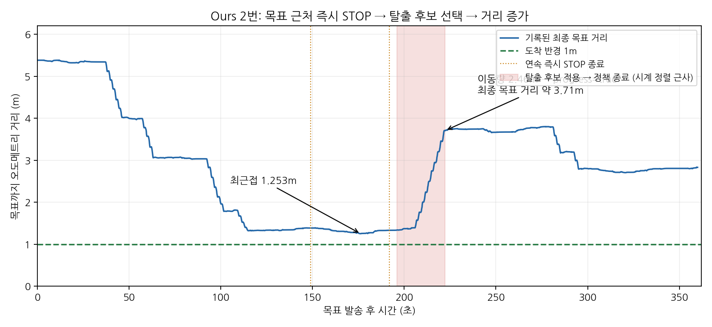

# PixelNav 실패 원인과 Ours 목표 근처 정체 후속 분석

2026-09-14. [정량 평가](../pixnav_quantitative_evaluation/README.md) 이후 추가로 확인한 내용이다. 원본 주행 로그, 당시 배포 이미지의 코드, 현재 코드와 보관된 canonical main을 대조했다. **제어 코드 수정이나 실로봇 시험은 수행하지 않았다.**

**Direct 4번의 실제 종료 원인은 모델 STOP이다. Ours 2번에서는 목표 근처의 연속 즉시 STOP 이후 탈출 모드가 목표 반대쪽 후보를 선택해 다시 멀어지는 과정이 확인됐다.** 별도로 Direct의 33번째 판단 종료 제한도 재현했다. 제한시간을 늘리거나 look 전진거리를 늘리는 한 가지 변경으로 모두 설명·해결되는 상태가 아니다.

## 1. Direct 4번은 왜 실패했는가

`recaptured5/direct_goal-goal-4-002~006`의 목표는 시작점에서 직선거리 11.303m다. 5회 모두 1m 도착 반경 밖에서 끝났으며 평균 최종 거리는 8.15m다.

| 회차 | 정책 출력 수 (STOP 포함) | 마지막 raw / 적용 행동 | 실제 종료 |
|---|---:|---|---|
| 002 | 21 | STOP / STOP | 모델 STOP |
| 003 | 31 | STOP / STOP | 모델 STOP |
| 004 | 29 | STOP / STOP | 모델 STOP |
| 005 | 21 | STOP / STOP | 모델 STOP |
| 006 | 16 | STOP / STOP | 모델 STOP |

- 총 118개 출력과 113개 실행 동작을 대조했고 좌우 명령 반전은 발견되지 않았다. 원본 코드 두 종류와의 기존 GPU 재생에서도 선택 행동이 같았다. 이번에는 원본 로그의 마지막 logits와 적용 행동을 다시 계산했다.
- look 31회는 모두 20cm 전진으로 대체·완료됐다. look 차단, VLM 호출 지연, 전체 360초 시간초과로 멈춘 사례가 아니다. Direct에는 VLM 호출이 없다.
- 실제 종료는 모델 출력이지만, **왜 모델이 그 STOP을 선택했는지를 학습 문제 하나로 확정할 증거는 없다.** 초기 영상의 목표 표시가 벽 영역에 놓이며, 하나의 목표 픽셀로 그 앞 표면과 뒤의 최종 목적지를 구별할 수 없는 입력 조건이 원인 후보다. 목표의 가시성·거리, 실제 카메라와 학습 관측의 차이, look의 전진 대체가 각각 영향을 줄 수 있다.
- 입력 좌표가 오른쪽이라는 사실만으로 매번 오른쪽 조향이 나오는 구조는 아니다. 모델은 목표 영상·마스크와 이후 관측 이력을 이용한다. 006의 좌회전도 실제 raw 정책 선택이었다.

[직접 확인한 STOP 및 logit 차이](direct_stops.csv), [원본 재생·방향 대조](../pixnav_direction_review/README.md). logit 차이는 확률이나 신뢰도의 보정된 척도가 아니다.

현재 자료는 **동일 Go2 어댑터를 사용하는 Direct-goal PixelNav의 해당 목표 반복 결과**로 보고할 수 있다. 002만 현장 무개입·무접촉·무방해 확인이 있고 나머지 네 회차는 미확인이다. 순정 PixelNav의 모든 조건에서의 실패나 Ours의 통계적 우월성으로 확대하지 않는다. SR/SPL 사용 범위와 원본 궤적은 [정량 보고서](../pixnav_quantitative_evaluation/README.md)에 있다.

## 2. 새로 찾은 Direct의 세션 길이 제한

실제 배포 PixelNavAgent에 항상 전진 logits를 내는 작은 가짜 네트워크를 연결했다. 모델 체크포인트는 로드하지 않았다. 컨테이너 네트워크를 차단했고 물리 명령은 0건이다. 이 시험은 **세션 제한 분기**를 검사하며 실제 정책 성능을 검사하지 않는다.

| 검사 | 실제 관측 |
|---|---|
| 배포 코드, 현재 `early_stop=True` | 32번 전진 반환 후 **33번째에 STOP**, `POLICY_HISTORY_LIMIT` |
| 원 저자 코드, 같은 `early_stop=True` | 동일하게 32번 전진 후 33번째 STOP |
| 배포 코드, `early_stop=False`로만 변경한 격리 시험 | 64번 전진 후 **65번째 관측에서 history exhausted 예외** |

현재 runtime은 `early_stop=True`로 호출한다. 바깥의 500스텝 설정이나 전체 1800초 설정만으로 이 내부 제한이 늘어나지 않는다. 원본에도 존재하므로 로봇 이식 과정에서 새로 만든 제한은 아니다. Full은 VLM 중간 목표 교체 시 정책 세션을 새로 시작하지만 Direct는 최종 목표 하나의 세션을 유지하므로 영향이 다르다.

**어제 5회는 모두 33번째 전에 raw STOP으로 끝났으므로 이 제한을 과거 실패의 직접 원인으로 바꾸지 않는다.** 다만 앞으로 긴 목표를 공정하게 비교할 때 반드시 명시·정리할 조건이다.

일반 전진 명령 25cm를 32번 수행하면 명목상 8m다. 회전은 이동거리를 늘리지 않고 look 전진은 20cm이므로 명목 전진량이 더 줄 수 있다.

| 목표 | 시작 직선거리 | 1m 반경까지 필요한 직선 이동 | 25cm 전진만 가정한 최소 횟수 |
|---|---:|---:|---:|
| 1 | 3.415m | 2.415m | 10 |
| 2 | 5.381m | 4.381m | 18 |
| 3 | 9.309m | 8.309m | 34 |
| 4 | 11.303m | 10.303m | 42 |
| 5 | 15.863m | 14.863m | 60 |

이는 **명령 거리 예산**이며 실제 이동의 엄밀한 상한은 아니다. 각 동작의 overshoot·drift가 있고 실제 경로에는 우회도 있다. 특히 3번부터는 단순히 ‘가까운 목표이므로 Direct도 문제없이 간다’고 가정할 수 없다.

앞선 검사에서 발견한 내부 300초 TTL도 별도로 남아 있다. 33회 제한만 끄면 64개 관측 용량을 만나므로, STOP 해석·세션 길이·기억 용량·전체 시간의 조건을 함께 정해야 한다. 세션을 임의로 재시작하거나 모델 STOP을 억제하면 기준 방법의 의미가 달라진다. 필요하다면 **원본 세션 조건과 장거리용 확장 조건을 이름·설정으로 구분하여 사전 고정**해야 한다. Ours 성공을 유리하게 만들기 위해 사후로 다른 조건을 적용해서는 안 된다.

근거: [실제 분기 재현](history_limit.json), [재현 코드](probe_history_limit.py), [거리 예산 CSV](direct_nominal_horizon_budget.csv).

## 3. Ours 2번이 가까워졌다가 다시 멀어진 과정

대상은 `original5/full-goal-2-006`, 9월 13일 21:40~21:46 KST다. 시작 직선거리는 5.381m이고 도착 반경은 1m였다. 이 회차에서는 VLM 요청 121건 중 HTTP 오류가 0건이었다.

| 단계 | 관측된 내용 |
|---|---|
| 접근 | 목표 발송 약 176.19초 후 최근접 **1.2525m**. 1m 반경에는 들어가지 않음 |
| 첫 즉시 STOP | 정책 세션 7이 첫 출력으로 STOP. 이동량 0, `no_progress=true` |
| 둘째 즉시 STOP | 세션 8도 첫 출력 STOP. 이후 supervisor가 `escape_deadlock`으로 바뀜 |
| 탈출 후보 선택 | 약 196초, 왼쪽 탈출구 방향의 후보 2개로 제한. 선택 후보의 목표 방향 차이 **146.672°**, 메타데이터 `away_from_goal` |
| 탈출 실행 | 세션 9에서 look 전진 3회·일반 전진 7회 후 STOP. 이동량 **2.456m**가 `progress=true`로 기록됨 |
| 목표와 불일치 감지 | 약 222초, 지역 정책 종료 시 `goal_consistent=false`. 최종 목표 거리 **3.707m**를 기록하고 재관측 요청 |
| 종료 | 재접근 뒤 다시 즉시 STOP 두 번. 360초에 시간초과, 종료 직전 거리 약 **2.831m** |



주황 점선은 두 즉시 STOP의 종료 시각이다. 붉은 구간은 탈출 후보 결정부터 해당 정책 종료까지이며 실제 전진 외에 사전 회전·추론도 포함한다. 이벤트의 monotonic delta를 같은 프로세스의 ROS 시각에 연결한 근사 구간이다. 거리는 오도메트리 추정치이며 외부 실측값이 아니다.

선택 당시 VLM 문장은 왼쪽이 목표로 향하는 경로라고 설명했지만, 함께 전달된 후보 메타데이터는 `away_from_goal`이었다. **VLM의 설명 문장을 실제 경로의 정확성 증거로 사용하지 않는다.** 이 각도는 캡처 관측 기준 후보 방향 차이이며 로봇이 정확히 146.672° 회전했다는 뜻도 아니다.

그 구간 종료 시 목표 불일치를 감지하고 방향 갱신을 요청했으므로, 목표 확인이 아예 없었던 것은 아니다. 다만 **이동했는지 판정하는 복구 처리와 최종 목표에 대한 진전 판정이 서로 다른 기준·시점으로 작동**했다. 앞선 즉시 STOP이 실제 장애물 정체였는지, 보이는 지역 픽셀에 대한 정책 완료였는지를 분리하지 못한 채 탈출로 넘어간 것이 점검 대상이다.

다른 방향이 실제로 통행 가능했는지, 해당 탈출이 불필요했는지는 외부 정답 경로나 대체 실주행이 없어 확정할 수 없다. 장애물을 우회할 때 일시적으로 목표와 멀어져야 할 수도 있으므로, 무조건 거리 감소만 허용하는 규칙으로 고쳐서는 안 된다.

60개 동작 결과 중 59개는 실행 완료였다. 마지막 하나는 전체 제한에 따른 직접 정지 **이후** `MOTION_INHIBITED`로 끝났다. 이것을 먼저 발생한 원인으로 오해하지 않는다.

근거: [13개 정책 구간의 결정·후속 결과 CSV](ours_goal2_chain.csv), [중요 VLM 입력·출력·실행·종료 원문](critical_decision_evidence.json), [집계·시간 기준](summary.json), [원래 전체 궤적](../night_log_review/episodes/original5/full-goal-2-006/trajectory.png).

### 코드 대조 결과

당시 실제 이미지 `21b6e54f…`에서 두 함수를 추출했다. 탈출 후보 제한 함수는 현재 로봇 소스 및 보관한 canonical main `fc336569a9a521ecd395925f41014bbcc9265c26`의 함수와 같다. 구형 실험 옵션이 다시 켜졌다는 증거는 없다. 이 main 참조를 이번에 원격에서 새로 fetch한 것은 아니다.

- `_pointnav_loop_escape_candidate_refs`: `escape_deadlock`과 loop 경고가 있으면 탈출구 점수·미탐색 상태·방향으로 후보를 제한한다. 이 함수의 직접 순위에는 최종 목표 거리 감소가 들어가지 않는다. 실제 기록에서도 왼쪽 탈출구 기준 필터가 적용됐다.
- `_record_pixnav_navigation_outcome`: 로봇 경로는 실제 동작의 이동량을 이용해 무진전을 판정한다. 그 이동량이 최종 목표까지의 거리 감소를 뜻하지는 않는다. 당시 코드와 현재 코드가 같다. main과는 로봇 실행 증거로 이동량을 보정하는 부분이 다르며, main도 해당 기본 판정은 이동량 기준이다.

전체 소스가 같다는 주장이 아니다. 함수별 원문과 비교 결과는 [당시 코드](historical_ours_source.json), [현재·main 대조](source_comparison.json)에 보존했다.

## 4. 우리 로직에서 우선 고려할 점

| 우선 항목 | 변경 시 지켜야 할 조건·검증 |
|---|---|
| 회전 완료 판정 | 목표 각도 도달 뒤 센서 미세 진동으로 오래 기다리는 사례를 수정. 실제 recoil·미끄러짐·회복 중 동작까지 완료로 오인하지 않는지 검사 |
| 명령 통신과 센서 처리 분리 | blocking 통신을 공용 센서 잠금 안에서 기다리는 구조 개선. 늦은 응답·취소·STOP 이후 과거 명령 재실행까지 검증 |
| 목표 근처 STOP과 탈출 모드 | 지역 정책 완료, 모델의 조기 STOP, 실제 움직임 실패를 구분. 선택 후보의 목표 정합성과 정체 이력을 함께 검사하고 타당한 우회는 보존 |
| 비동기 후보·복구 평가 시점 | 최종 목표 불일치가 구간 끝에서야 반영되는 사례를 검사. 동작 경계에서 갱신 가능한지 확인하되 움직일 때마다 동기 VLM 대기를 추가하지 않기 |
| Direct의 세션·시간 계약 | 32개 행동/64개 관측/300초 TTL/전체 제한을 각각 명시. 임의 재시작·STOP 대체를 원본 기준 실험으로 섞지 않기 |
| 평가 좌표와 성공 판정 | 고정 시작점 오도메트리를 ICP 정합으로 부르지 않기. 실제 시작 방향·도착 위치·벽 반대편 반경 진입 여부를 확인하고 SPL에는 검토된 최단 경로 참조 사용 |
| 반복 기록의 완결성 | 같은 조건 Ours/Direct, 동일 목표·시작·시간·look 어댑터 유지. 개입·방해 미확인 회차를 정상으로 채우지 않고 디스크·기록 제한 함께 확인 |

앞의 회전·센서 처리 문제와 Direct 300초 TTL은 [이전 재현 보고](../drive_timing_review/README.md)에 있다. **현재 미수정 상태다.** 새 5번의 회전 시간초과는 실제 각도 시계열 재생으로 설명됐고, `LOCALIZED_POSE_STALE`는 새 센서가 들어와도 콜백 처리가 막힐 수 있는 경로를 재현했다. 단, 과거 해당 STALE 회차의 실제 통신 지연이 기록되지 않아 그 원인을 하나로 확정하지 않았다.

마지막 Ours 4번의 네트워크 timeout과 사용자가 확인한 수동 이동도 별개다. 수동 이동 이후 수십 m 궤적을 자율 주행 경로/SPL로 합산하지 않는다. [회차별 분석](../night_log_review/README.md).

전진·회전 상한을 더 높이는 것부터 적용할 근거는 부족하다. 이전 Ours 4번 성공 회차에서는 회전 구간 중 약 97.5초가 0 각속도 명령의 완료 대기였다. 비동기 HTTP와 전진의 중첩은 실제 있었으며, 전진/회전을 별도 행동으로 실행하는 것 자체는 현재 정책 체계와 일치한다. 명령 상한과 전체 이동 효율을 구분해야 한다.

## 5. 이번 검증 범위와 재현

- Direct 5회 마지막 raw STOP, 총 118개 출력·31개 look 대체 집계 확인.
- Ours 2번 45개 정책 출력, 13개 완료 세션, 60개 동작 결과와 121개 VLM 요청을 대조. 정책 파일의 session index와 완료 결정은 **시간 순서로 연결**했으며 결정 ID가 직접 들어 있는 정책 출력 파일인 것처럼 취급하지 않는다.
- 소비한 과거 자료는 기존 `SHA256SUMS`와 일치 확인. 새 결과는 이 폴더의 SHA256SUMS로 별도 봉인한다.
- 실제 PixelNavAgent와 원 저자 코드의 33번째 종료 분기, 배포 코드의 65번째 관측 용량 제한을 CPU 가짜 전진 출력으로 재현.
- 숫자 재계산과 소스 분기 재현은 실주행 통과나 충돌 회피 성능 검증이 아니다. 원본 정책의 STOP을 계속 전진으로 바꾸는 실험이나 무조건 복구 제한을 해제하는 수정은 하지 않았다.

```bash
# 로봇/GPU 없이 저장된 원본에서 표·그림을 새 폴더로 재생성
python3 experiments/0914/pixnav_failure_followup/analyze_failure_chain.py --output /tmp/pixnav-failure-reproduced

# 이 폴더 안에서 제출본 무결성 확인
sha256sum -c SHA256SUMS
```

격리된 history 시험의 이미지·명령과 기록 시각은 [실행 정보](execution_manifest.json), 검사 결과는 [validation.json](validation.json)에 있다. 모델 원인이나 대체 경로의 성공을 확정할 새로운 실로봇 데이터는 이번 작업에서 생성되지 않았다.
