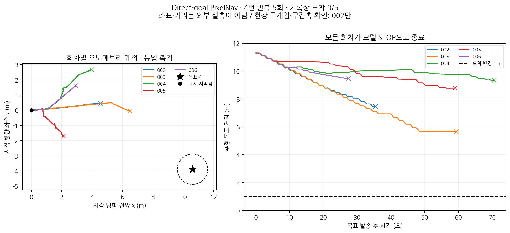

# Direct-goal PixelNav 정량 평가와 1·2·3번 주행 로직 점검

2026-09-14 작성. 대상은 **9월 13일 밤 실험에 이어 14일 00:35~00:50 KST에 수행한 PixelNav 4번 목표 주행 5회**다. 한 목표를 다섯 번 반복한 결과이며, 다섯 개 목표를 한 번씩 주행한 결과가 아니다. 원본 기록·실행 설정은 보존했고 이번 작업에서는 로봇을 구동하거나 제어 코드를 수정하지 않았다.

**기록상 목표 도착은 0/5회(0%)다. 다섯 회차 모두 최종 목표에 도달하기 전에 PixelNav 모델이 STOP을 선택했다.** 평균 최종 목표 거리는 오도메트리 기준 **8.15m**, 평균 실행 시간은 **50.33초**다. 개입·접촉·진로 방해가 없었다는 현장 확인은 002만 확보했고 나머지 네 회차는 미확인 상태로 그대로 포함했다.

**1·2·3번에서 Ours와 PixelNav의 주행 로직에 문제가 없다고 말할 수는 없다.** Ours의 1·3번 도착 기록과 2번 시간초과 기록이 있으며, 이 목표 세트의 Direct 1·2·3번 실제 주행 자료는 없다. 좌표 선택·변환과 합성 입력의 연결 검사는 통과했지만, 공통 회전 완료 판정 및 센서 처리 결함이 아직 수정되지 않았다.

## 1. 실험 조건과 평가 대상

| 항목 | 당시 실제 조건 |
|---|---|
| 방법 이름 | **Direct-goal PixelNav**, 동일 Go2 어댑터 적용 |
| 목표 | 4번 `(10.613861, -3.886406)m`, 표시 시작점에서 직선거리 **11.303m** |
| 시작·위치 추정 | 매 회차 표시 시작점·방향에 재배치 후 오도메트리 재앵커; ICP 전역 보정 없음 |
| 목표 전달 | 처음 영상에 최종 좌표를 투영한 픽셀·고정 목표 영상. VLM 중간 목표 없음 |
| 정책 | 체크포인트 A, 6개 행동; 카메라 `calibrated_4_3` 변환 |
| look_up/down | 둘 다 **20cm 전진**으로 실행; 실제 카메라 pitch 동작 없음 |
| 일반 전진 / 회전 | 25cm / 좌우 30°; 속도 명령 상한 0.5m/s / 0.8rad/s |
| 도착 조건 | 오도메트리 기반 목표 직선거리 **1m 이내 자동 종료** |
| 최종 방향 | **평가·제어하지 않음**. 저장 당시 yaw와 같은 방향으로 서는 PoseGoal이 아님 |
| 전체 제한 | 당시 **360초**; Direct 최대 500스텝, 내부 정책 세션 300초 |
| VLM / Full 관측 | VLM 호출 0회, Full 관측 sweep 없음 |

후속 1800초 설정이나 제안한 600초를 이 과거 결과에 소급 적용하지 않는다. 속도 0.5m/s는 상한이며 가감속·정지·추론까지 포함한 평균 이동속도가 아니다.

당시 navigation 이미지: `sha256:8a36ebd1ee5a03f7b0a3446c138e0989f67536db9c11c70a1c27e116f32e0e98`.
체크포인트 SHA-256: `0b1faff7631962351bbbfe8cb115a3a03069f33fab499865f887ffbb5a3cabe3`.
평가 지도 식별자: `38348c5458ce632851c628f53a51f3fee40cf1678e5fb982361bd1f50fb16ad9`.
지도 식별자를 보존했다는 것이 지도 정합 위치를 사용했다는 뜻은 아니다.

## 2. 회차별 정량 결과

아래 번호는 모두 `direct_goal-goal-4-XXX`의 마지막 세 자리다. 이동 경로와 목표 거리는 **오도메트리 추정치**이며 외부 실측값이 아니다.

| 회차 | 소요 시간(s) | 이동 경로(m) | 최종 거리(m) | 최근접 거리(m) | 실행 동작 / 회전 | 현장 조건 |
|---|---:|---:|---:|---:|---:|---|
| 002 | 35.40 | 4.91 | 7.46 | 7.45 | 20 / 0 | 개입·접촉·방해 없음 확인 |
| 003 | 59.34 | 7.06 | 5.66 | 5.66 | 30 / 4 | 미확인 |
| 004 | 70.54 | 6.01 | 9.35 | 9.34 | 28 / 6 | 미확인 |
| 005 | 58.90 | 3.73 | 8.79 | 8.79 | 20 / 8 | 미확인 |
| 006 | 27.48 | 3.73 | 9.47 | 9.46 | 15 / 1 | 미확인 |

모두 종료 이유는 `PIXNAV_TERMINAL_BEFORE_GOAL`이다. `001`은 `ERROR:NODE_UNAVAILABLE:sweep_scheduler_node`로 **목표 발송 전 종료**했다. 주행 5회의 분모에서만 제외했고, 실행 시도 목록에는 포함했다. 즉 **실행 시도 6건 = 발송 전 실패 1건 + 실제 주행 5건**이다. 준비만 된 디렉터리는 실험 횟수로 세지 않았다.

| 요약 지표 | 결과 |
|---|---:|
| 로그 기준 도착률 `SR_odom` | **0/5 = 0%** |
| 주행 중 한 번이라도 1m 반경에 들어간 비율 | **0/5 = 0%** |
| 무개입·무접촉·무방해 확인 하위 집합 | 002 한 회차, 도착 **0/1** |
| 최종 목표 거리 평균 ± 표본 표준편차 | **8.15 ± 1.60m** |
| 종료 시간 평균 ± 표본 표준편차 | **50.33 ± 18.08초** |
| 이동 경로 평균 ± 표본 표준편차 | **5.09 ± 1.45m** |
| 시작 대비 목표 거리 감소율 평균 | **27.94%** |
| 모델 STOP으로 조기 종료 | **5/5회** |
| 실행한 개별 동작 완료 실패 | **0/113동작** |
| VLM 요청 / 전체 시간초과 | **0회 / 0회** |

거리 감소율은 `(시작 직선거리 − 최종 추정거리) / 시작 직선거리`다. 경로 효율이나 SPL로 해석하지 않는다. 반복은 동일한 한 목표에서 이루어졌으며, 이 표만으로 전체 환경이나 모든 목표에 대한 모집단 성능을 추정하지 않는다.



왼쪽은 각 회차의 표시 시작점을 원점으로 겹친 궤적이며 x는 전방, y는 좌측이다. 축 단위는 m이고 가로·세로 축척이 같다. `×`는 기록 종료 지점이다. 실제 재배치 방향 오차와 오도메트리 drift가 포함될 수 있으므로 지도상의 정확한 공통 궤적이나 Ground Truth로 사용하지 않는다. 그림의 목표까지 연결되는 통행 가능 최단 경로를 계산한 것은 아니다.

전체 정밀도 숫자는 [episodes.csv](episodes.csv), [episodes.json](episodes.json), [summary.json](summary.json), [시도 목록](attempt_inventory.csv)에 있다. [PDF 그림](goal4_quantitative.pdf)과 `trajectories/`, `goal_distances/`의 회차별 CSV도 포함했다.

## 3. SR/SPL로 어느 수준까지 사용할 수 있는가

**현재 선언한 실로봇 프로토콜의 로그 기반 실패율·종료 거리·시간·추정 경로 길이를 정량 결과로 공유할 수 있다.** 002는 현장 무개입 확인까지 있는 조기 STOP 실패 사례다. 003~006도 로그상의 실패 결과는 보존하되, 현장 조건을 임의로 ‘이상 없음’으로 채우지 않는다. 기록 무결성 검사 통과와 현장 조건 확인은 별개다.

SPL은 `mean(S_i × L_i / max(L_i, P_i))`다. `L_i`는 통행 가능한 최단 경로, `P_i`는 주행 경로, `S_i`는 선언한 도착 기준의 성공 여부다. 이번 5회를 현재 프로토콜의 실패(`S_i=0`)로 평가 집합에 채택하면 **각 실패의 SPL 기여는 모두 0**이다. 이는 최단 경로를 추정했다는 뜻이 아니다. Ours의 성공 회차까지 포함한 정식 SPL 비교를 완성하려면 검토된 최단 경로 참조와 실제 도착 확인이 필요하다. 이 묶음의 `paper_spl`은 미확정으로 남기고, 조건부 실패 기여 `failure_spl_contribution_if_admitted=0`을 따로 제공한다. [SPL 정의와 평가 권고 원문, §4](https://arxiv.org/pdf/1807.06757).

현재 **직선거리 자동 도착·최종 yaw 미평가** 규칙은 원문의 DONE 행동·geodesic 근접도 권고와 다르다. 보고서나 논문에서 실로봇 프로토콜을 명시해야 한다. 특히 벽을 사이에 둔 1m는 통행 가능한 경로 기준 1m와 다를 수 있다. [평가 권고 원문, §4](https://arxiv.org/pdf/1807.06757).

따라서 다음과 같은 범위로 설명할 수 있다.

> 동일 Go2 어댑터를 적용한 Direct-goal PixelNav를 직선거리 11.30m의 4번 목표에서 5회 반복했다. 오도메트리 기반 1m 도착 기준에서 기록상 성공은 0/5였고, 모두 모델 STOP으로 조기 종료했다. 평균 최종 추정거리는 8.15m, 평균 종료 시간은 50.33초였다. 1회는 현장 무개입·무접촉·무방해가 확인되었고 4회는 해당 조건이 미확인이다. 가려진 최종 목표를 초기 영상의 픽셀로 투영하는 조건이며, look 동작은 20cm 전진으로 대체했다.

이 결과를 ‘순정 PixelNav는 정상 가시 목표에서도 항상 실패한다’거나 ‘Ours의 통계적 우월성이 입증됐다’고 확대하지 않는다. Ours의 성공 회차만 골라 이 5회와 비교하는 것도 피해야 한다.

## 4. 왜 실패했는가: 기록이 지지하는 범위

1. **직접 종료 원인은 모델 STOP이다.** 118개 출력 중 최종 STOP 5개가 모두 원래 logits의 최대값이며, raw/effective 행동은 같다. 113개의 실제 이동·회전 명령은 정책 행동에 대응했고 모두 완료 `OK`였다. 300초 세션 제한, 360초 전체 제한, 500스텝에 도달하기 전에 끝났다.
2. **검사한 입력에서는 좌우 명령 반전·정책 이식의 행동 불일치를 찾지 못했다.** 앞선 Jetson 재생에서 원본 두 구현 모두 118개 행동이 동일했다. 한 원본과 수치까지 완전히 같지는 않았으므로 행동 일치와 수치 동등성을 구분한다. [원본 재생 대조](../pixnav_direction_review/README.md).
3. **최종 목표를 표현하는 조건에 한계가 있다.** Direct는 처음 영상의 목표 픽셀과 이후 관측 이력으로 행동한다. 목표의 오른쪽/왼쪽 값만으로 조향하는 제어기가 아니다. 이 실험의 초기 목표 표시가 벽에 겹치므로, 픽셀 하나로 앞의 벽 표면과 그 뒤 최종 목적지를 구분할 수 없다. 이 표현 조건과 로봇 영상·동작 차이는 실패 원인 후보이며, 내부 모델 원인을 하나로 확정한 것은 아니다.
4. **look→20cm 전진이 막힌 사례는 아니다.** look_down 26회·look_up 5회가 전진으로 완료됐다. 총 31회 대체 동작을 넘겼지만 최종 목표 도착으로 연결되지 않았다. 이를 원래 look과 동일한 관측 효과가 검증됐다고 해석해서도 안 된다.

방향 이탈의 구체적 예는 006이다. 목표가 당시 오른쪽에 있었어도 모델은 좌회전을 선택했고, 실행기는 그 선택대로 왼쪽으로 회전했다. 최종 방향이 기대와 다른 것만으로 실행기 부호 오류라고 결론 내릴 수 없다. [입력·행동·실측 회전 대조](../pixnav_direction_review/last_trial_direction.png).

## 5. 1·2·3번은 두 방법 모두 완벽하게 주행하는가

**아니다. 목표 전달의 일부 계약은 확인했지만 전체 주행 로직에는 알려진 결함과 실험 공백이 남아 있다.** 같은 지도·목표를 사용하고 동일한 Ours 이미지 `21b6e54f…`로 수행한 아래 세 회차를 보면 다음과 같다.

| 목표 | 시작 직선거리 | Ours 실제 기록 | Direct-goal PixelNav 실제 기록 |
|---|---:|---|---|
| 1 | 3.415m | `full-goal-1-007`: 53.62초, **0.983m에서 도착 종료** | 검토한 캠페인에 없음 |
| 2 | 5.381m | `full-goal-2-006`: **360초 시간초과**, 최종 2.831m; 최근접 1.253m | 검토한 캠페인에 없음 |
| 3 | 9.309m | `full-goal-3-008`: 181.35초, **0.972m에서 도착 종료** | 검토한 캠페인에 없음 |

1·3번은 도착 로그와 pose가 있지만 당시 `sweep_scheduler_trace.jsonl` 누락으로 전체 기록 무결성 검사는 실패했다. 이 때문에 pose와 종료 거리까지 없어진 것은 아니지만 ‘모든 기록이 완전하다’고 보고할 수는 없다. 현장 도착 확인도 해당 원본 보고 상태를 유지한다. 이전 속도·look 설정의 실패까지 포함한 전체 이력은 [ours_goal123_history.csv](ours_goal123_history.csv)에 보존했다. 이 세 회차를 현재 이미지의 반복 성공률로 합산하지 않는다.

이번 현재 코드·설정 점검 결과:

- Full/Direct 각각 1·2·3번 **준비 설정 6개**에서 목표 번호·좌표·도착 반경·look 거리·속도·지도 기준이 일치했다. 준비 파일의 존재는 실주행 증거가 아니다.
- 실제 `fixed_start_goals.goal_in_odometry()`로 서로 다른 시작 위치·방향에서 **12개 좌표 왕복 변환**을 검사했고 오차가 1e-12m 미만이었다. 저장 목표를 다른 번호로 보내거나 단순 좌우 부호를 뒤집는 오류는 이 검사에서 나타나지 않았다.
- 앞선 실제 ROS 콜백 검사에는 1·2·3번 좌표도 포함되어 있었다. 다만 합성 영상과 미리 정한 `look_down, look_down, stop` 출력을 사용하는 시험이다. 실제 PixelNav가 현장에서 올바른 경로를 선택하는 성능 시험은 아니다.
- 초기 시야에서 실제 목표가 보이는지는 이번 좌표 검사로 검증되지 않았다. 특히 3번은 직선거리 약 9.31m다. ‘1~3번은 목표가 보이므로 모두 잘 간다’고 가정하지 않는다.

### 아직 남아 있는 공통 구현 문제

| 문제 | 1·2·3번에도 관련되는 이유 | 현재 상태 |
|---|---|---|
| 회전 후 미세 진동으로 완료 판정 지연·실패 | Full/Direct 모두 동일한 실행기를 사용; 목표 번호와 무관 | **미수정** |
| 명령 응답 대기로 센서 처리가 밀려 `STALE` 발생 | 두 방법의 공통 명령·센서 처리 경로 | **미수정** |
| Direct 내부 정책 세션 300초와 전체 1800초 불일치 | Direct의 단일 세션이 오래 지속되는 목표 모두 | **미수정** |
| 고정 시작점 방향·오도메트리 drift | 두 방법의 목표 발송·도착 판정 좌표 기준 | 실제 배치·도착 오차는 외부 확인 필요 |

이번 점검에서 회전·실행기·통신 소스의 해시는 결함을 재현했던 시점과 같았고, 현재 준비된 Direct 설정에도 정책 TTL 덮어쓰기가 없었다. 목표가 짧으면 문제를 만나기 전에 도착할 수 있지만, 그 사실로 주행 로직 전체가 올바르다고 증명되지는 않는다. 반대로 이 결함을 어제의 Direct STOP 5회 원인으로 소급하지도 않는다. [현재 설정·좌표·소스 점검 결과](current_logic_audit.json), [결함 재현 근거](../drive_timing_review/README.md).

현재 다음 회차 파일의 전체 제한은 여전히 **1800초**다. 대화에서 제안한 600초는 적용하지 않았다. 이 문서는 정량 분석 자료이며 남은 제어 수정의 완료 보고가 아니다.

## 6. 자료 검증·재현

- 원본 압축 이벤트를 읽어 목표 발송부터 최초 직접 정지 요청까지의 시간을 다시 계산했다.
- 원본 odom XY를 5·10·20Hz로 선형 보간하는 별도 계산을 사용했다. 기존 기록의 시간·최근접 거리·세 가지 경로 길이가 1e-6 허용오차 안에서 일치했다.
- 경로에는 정지 후 관성 이동을 포함하지 않는다. 원본 결과의 최종 거리 snapshot은 정지 요청 직전 약 45ms부터 직후 약 19ms 사이의 수신값이다. 이 차이를 `final_distance_receipt_relative_to_stop_s`로 명시했으며 최종 거리와 경로 종단이 완전히 같은 물리 시각이라고 주장하지 않는다.
- 118개 정책 출력과 113개 실행 완료 동작의 종류·부호를 다시 확인했다. 이는 이전 GPU 원본 재생을 새로 수행했다는 뜻은 아니다.
- 읽은 이전 분석 자료의 해시는 각 묶음의 기존 `SHA256SUMS`와 대조했다. 대형 rosbag 전체를 다시 읽은 검사는 아니며 읽은 파일 목록은 [input_provenance.json](input_provenance.json)에 있다.
- 검증 결과: [validation.json](validation.json). 원본 현장 입력 `0`을 임의로 `0 0 0`으로 바꾸지 않았으며, 002의 사용자 후속 확인만 별도로 반영했다.

다른 팀원은 상위 `experiments/0914/`와 함께 이 폴더를 받으면 정량 자료·원문 근거·기존 재생 결과를 확인할 수 있다. 이 분석에는 로봇이나 GPU가 필요 없다. Python의 NumPy, Matplotlib과 한국어 그림용 NanumGothic 글꼴을 사용했다.

```bash
# 저장된 제출본을 덮어쓰지 않고 새 폴더에서 집계·그림 재생성
python3 experiments/0914/pixnav_quantitative_evaluation/build_report.py --output /tmp/pixnav-evaluation-reproduced

# 이 Jetson의 현재 준비 설정·소스 점검: 실제 주행은 수행하지 않음
python3 experiments/0914/pixnav_quantitative_evaluation/audit_current_logic.py --output /tmp/pixnav-current-logic.json

# 현재 묶음 파일의 무결성 확인: 이 폴더 안에서 실행
sha256sum -c SHA256SUMS
```

공통 제어 코드의 수정, 시간제한 변경, 로그 삭제, 커밋·푸시는 이번 작업에서 수행하지 않았다.
