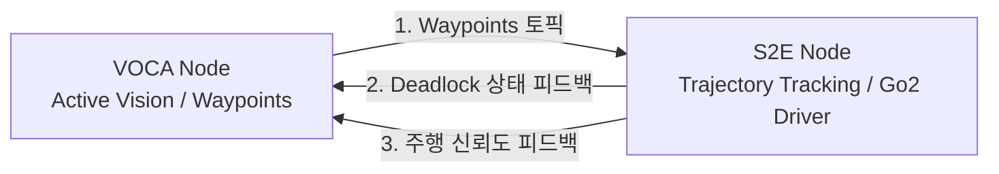

# 📝 VOCA-S2E 양방향 피드백 결합 설계 제안서 (Proposal)

- **작성자**: 이민석 (자율주행 및 실하드웨어 배포 담당)
- **제안 일자**: 2026년 7월 11일
- **목적**: 7/13 ~ 7/17 진행 예정인 **VOCA-S2E 물리적 결합(Physical Coupling)** 단계에서, 단방향 제어로 인한 교착(Deadlock) 문제를 해소하고 강건한 실전 주행을 확보하기 위한 **양방향 피드백 통신 아키텍처**를 정의함.

---

## 1. 개요 및 배경 (Problem Statement)
현재 계획된 물리적 결합은 **[VOCA(길잡이) ➔ S2E(운전사)]**의 단방향 웨이포인트(Waypoint) 전달 방식입니다.
*   **문제점**: 로봇이 물리적 장애물이나 슬립(Slip)으로 인해 보행이 불가능한 교착 상태(Deadlock)에 빠져도, 상위 VOCA는 이를 인지하지 못하고 도달 불가능한 목표를 계속 명령하는 **오픈 루프(Open-loop) 제어 병목**이 발생합니다.
*   **해결 방안**: 저수준 제어를 제어하는 S2E 노드가 로봇의 물리 상태를 모니터링하여 역방향으로 VOCA에게 긴급 피드백을 전달하는 **클로즈드 루프(Closed-loop) 제어망**을 구성합니다.

---

## 2. 제안 아키텍처 (Proposed ROS 2 Topics)

물리적 결합 단계를 고도화하기 위해 다음 3개의 ROS 2 토픽을 개설하여 양방향 데이터 피드백 고리를 형성합니다.

### 1) [VOCA ➔ S2E] : Waypoint 경로 전달
*   **토픽명**: `/navigation/waypoints`
*   **메시지 타입**: `geometry_msgs/PoseArray` (혹은 Custom Trajectory Array)
*   **내용**: VOCA가 헤드 세이킹(두리번거리기)을 거쳐 최종 판단한 `10 x 2` 차원의 로봇 기준 상대 좌표 경로.

### 2) [S2E ➔ VOCA] : 교착 상태 감지 피드백 (Deadlock Trigger)
*   **토픽명**: `/robot/status/deadlock`
*   **메시지 타입**: `std_msgs/Bool`
*   **감지 조건 (S2E 모니터링)**:
    *   S2E가 지령하는 전진 속도 명령($V_{cmd} > 0.2\text{ m/s}$)이 유효함에도 불구하고,
    *   로봇개의 실측 오도메트리 속도($V_{odom} < 0.02\text{ m/s}$) 상태가 **1.5초 이상 지속**될 때 `True` 발행.
*   **VOCA 대응 거동**: 해당 토픽 수신 즉시 현재 경로 추종을 중단하고, **액티브 비전(두리번거리며 탈출 궤적 재탐색) 모드**를 즉각 강제 가동(Trigger).

### 3) [S2E ➔ VOCA] : 주행 신뢰도 피드백 (Uncertainty / Confidence)
*   **토픽명**: `/navigation/s2e_confidence`
*   **메시지 타입**: `std_msgs/Float32` (Range: 0.0 ~ 1.0)
*   **내용**: S2E GMM 정책 모델의 score head가 평가한 현재 웨이포인트 경로의 추적 신뢰도(Confidence).
*   **VOCA 대응 거동**: 신뢰도가 임계치(Threshold) 미만으로 하락할 경우, 로봇개가 험지나 미끄러운 구역에 진입한 것으로 간주하여 **안전 구역(인도 중앙선)으로 유턴하거나 주행 경로의 가중치를 우회 방향으로 수정**.

---

## 3. 기대 효과 (Expected Benefits)
1.  **데드락 복구 지연 최소화**: 로봇이 물리적으로 갇힌 순간 1.5초 내로 상위 길잡이(VOCA)가 감지하여 회복 알고리즘을 구동할 수 있어, 멈춰 서서 대기하는 교착 시간을 극적으로 줄임.
2.  **안전성(Safety) 확보**: 저수준 휠 슬립이나 노면 변화를 상위 플래너가 통신 피드백으로 전해 받음으로써 가상(Sim)과 현실(Real)의 갭을 극복하는 강건한 자율주행 완성.
