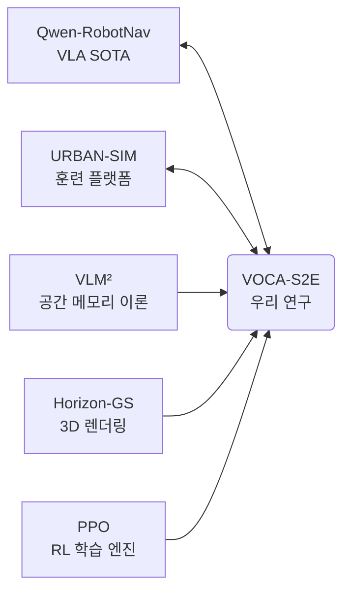

# 📚 논문 연구 내역 및 URBAN-SIM 맵 설정 파라미터 종합 보고서

본 보고서는 VOCA-S2E 프로젝트의 학술적 포지셔닝을 검증하기 위해 리서치한 **5종의 핵심 논문/저장소 내역**과, 시뮬레이터 내에서 가상 훈련장을 생성할 때 사용하는 **모든 맵 설정 파라미터(23개)**를 상세하게 정리해 둔 참조 메뉴얼입니다.

---

## 1. 📖 우리가 리서치한 핵심 논문 및 저장소 내역 (5종)

우리의 주행 프레임워크(VOCA-S2E)와 시뮬레이션 검증 환경의 근간을 입증하기 위해 아래의 문헌들을 전방위적으로 추적 및 검증하였습니다.

### ① URBAN-SIM (Towards Autonomous Micromobility through Scalable Urban Simulation)
*   **문헌 식별자**: `arXiv:2505.00690` (CVPR 2025)
*   **핵심 요약**: 사족보행 및 휠체어 로봇의 인도시설 자율주행을 대규모 학습시키기 위한 NVIDIA Omniverse 기반 시뮬레이터. 절차적 맵 생성(Procedural Generation)과 Jax 기반 ORCA 멀티에이전트 충돌 회피 알고리즘을 장착함.
*   **우리 연구와의 관계**: 우리가 Go2 로봇개의 보상 튜닝 및 난이도별 커리큘럼(Stage 1~4)을 주입하여 강화학습을 수행하는 **기반 가상 세계(Gym Environment)**입니다.

### ② Qwen-RobotNav (Alibaba Qwen3-VL Base Model)
*   **문헌 식별자**: GitHub `QwenLM/Qwen-RobotNav`
*   **핵심 요약**: Qwen3-VL 멀티모달 비전-언어 모델 뒤에 가벼운 4-layer MLP 행동 헤드를 덧붙여서 8개의 미래 웨이포인트를 직접 추출해내는 최첨단 VLA(Vision-Language-Action) 자율주행 모델.
*   **우리 연구와의 관계**: S2E 모델이 이미지를 받아 [비전 백본 ➔ 미래 웨이포인트 예측]을 수행하는 아키텍처가 글로벌 빅테크의 최첨단 VLA 모델 아키텍처와 **동일한 주류 설계 방향**임을 입증하는 가장 강력한 방어 문헌입니다.

### ③ VLM² (Vision-Language Memory for Spatial Reasoning)
*   **문헌 식별자**: `arXiv:2511.20644` (2025년 11월)
*   **핵심 요약**: 로봇이 복잡한 3D 공간을 장기 주행할 때, 작동 메모리(Working Memory)와 에피소드 메모리(Episodic Memory)를 병렬 구성하여 과거 행동 이력을 바탕으로 공간 인지력을 유지하는 방법론.
*   **우리 연구와의 관계**: 벽이나 장애물에 끼었을 때 VOCA 모듈이 작동하여 주행 뇌정지를 탈출하기 위해 주변을 둘러보고(`look-around`), 과거 이력을 추적하여 우회로를 재계산하는 **VLM 공간 기억 장치 설계의 학술적 모태**가 됩니다.

### ④ Horizon-GS (Unified 3D Gaussian Splatting)
*   **문헌 식별자**: `arXiv:2412.01745` (2024년 12월)
*   **핵심 요약**: 하늘에서 찍은 항공 뷰와 도로 지상 뷰를 융합하여 정밀한 실사급 3D 환경을 복원해내는 가우시안 splatting 재구성 기술.
*   **우리 연구와의 관계**: 건민 님이 PPO 학습 후 모델의 실사 전이 성능을 최종 평가할 환경인 **`navbench-gs` (실사 3D 복원 주행 테스트 벤치)**의 원천 렌더링 엔진 기술입니다.

### ⑤ PPO (Proximal Policy Optimization Algorithms)
*   **문헌 식별자**: `arXiv:1707.06347` (OpenAI, 2017)
*   **핵심 요약**: 정책 경사법(Policy Gradient) 수행 시 정책 업데이트 폭이 너무 튀지 않도록 클리핑 기법($\epsilon$)을 도입한 신뢰 구역(Trust Region) 강화학습 알고리즘.
*   **우리 연구와의 관계**: URBAN-SIM 가상 세계에서 Go2의 RAM(잔차 적응 모듈)이 장애물 회피 패널티를 받아 가며 궤적 추종 오차를 최소화하도록 정책 신경망을 최적화하는 **학습 백본 알고리즘**입니다.

---

## 2. 🗺️ URBAN-SIM 맵 및 지형 생성 전체 파라미터 (23종 명세서)

YAML 설정 파일과 시뮬레이션 로더 환경에서 가상 세계를 조절하는 모든 핵심 매개변수들의 상세 명세서입니다.

### 2.1 🔗 1단계: 순정 지형 및 오브젝트 배치 기본 파라미터 (`pg_config`)
이 매개변수들은 절차적 맵 생성 시 인도와 도로의 기본 틀과 스폰 개수를 제어합니다.

1.  **`type`** (기본값: `'dynamic'`): 환경 유형. `'clean'`(장애물 없음), `'static'`(정적 장애물만), `'dynamic'`(장애물 + 보행자) 중 선택.
2.  **`map_region`** (기본값: `20` / 우리 설정: `30`): 2D 정방형 맵의 한 변의 길이 (m).
3.  **`num_object`** (기본값: `10` / 우리 설정: `30`): 보도 위에 무작위로 투하할 벤치, 쓰레기통 등의 정적 장애물 수.
4.  **`num_pedestrian`** (기본값: `9` / 우리 설정: `8`): 돌아다닐 마주 오는 동적 보행자 수.
5.  **`with_terrain`** (기본값: `False`): WFC 기반 3D 지형(계단, 경사, 자갈) 활성화 여부.
6.  **`with_boundary`** (기본값: `True`): 로봇이 맵 밖으로 완전 탈출하는 것을 방지하는 외곽 벽체 생성 여부.
7.  **`unique_env_num`** (기본값: `20` / 우리 설정: `256`): 메모리 풀에 미리 로드해 둘 고유한 무작위 맵의 갯수.
8.  **`moving_max_t`** (기본값: `80`): 보행자가 한 궤적으로 쭉 이동하는 최대 시간 스텝 수.
9.  **`seed`** (기본값: `0` / 우리 설정: `423`): 맵 형태를 고정하기 위해 주입하는 랜덤 시드값.

### 2.2 ⚡ 2단계: 최적화 제너레이터 (`s2e_auto`) 전용 주입 파라미터
상준 님이 최적화한 `s2e_auto` 맵 생성기 내부에서 보행로 기하와 장애물 회피 틈새를 고도로 튜닝하는 파라미터 리스트입니다.

10. **`use_grid`** (기본값: `True`): 인도 레이아웃을 격자(Grid) 구조로 정밀 정렬할지 여부.
11. **`sidewalk_min_width` / `sidewalk_max_width`** (기본값: `4.0` / `6.0`): 인도의 좌우 가로폭 최소/최대 치수 (m). (로봇개 폭이 0.4m이므로 4.0m는 충분히 우회 가능한 폭)
12. **`straight_probability`** (기본값: `0.30`): 도로망 중 직선 보도 코스가 선택될 확률.
13. **`c_curve_probability` / `s_curve_probability`** (기본값: `0.35` / `0.35`): C자 곡선, S자 곡선 보도 코스가 생성될 확률.
14. **`curve_amplitude_ratio`** (기본값: `0.18`): 곡선 보도의 좌우 휘어짐 급격도 비율.
15. **`min_goal_distance` / `max_goal_distance`** (기본값: `6.0` / `14.0`): 로봇개 스폰 위치 기준 목적지가 생성될 최소/최대 직선 거리 (m).
16. **`goal_distance_increment`** (기본값: `2.5`): 커리큘럼 레벨업 시 목적지 거리를 얼마나 늘릴지 결정하는 증가량 (m).
17. **`object_edge_margin`** (기본값: `0.55` / 단위: m): 장애물이 보도 경계석(연석)에서 안쪽으로 강제 이격되어 배치되어야 할 최소 마진.
18. **`object_min_spacing`** (기본값: `1.35` / 단위: m): 장애물들끼리 겹치지 않고 스폰되어야 하는 최소 안전 거리.
    *   *분석*: 이 값이 $1.35\text{ m}$ 수준이면 로봇개($0.4\text{ m}$)가 장애물 사이를 비집고 지나갈 수 있지만, 이보다 작아지면 물리적으로 차단되어 차도 이탈을 해야만 합니다.
19. **`endpoint_object_clearance`** (기본값: `2.5` / 단위: m): 출발점과 도착점 주변에 장애물이 스폰되어 시작하자마자 충돌하는 참사를 막는 빈 공간 반경.
20. **`object_candidate_attempts`** (기본값: `8`): 장애물 충돌 조건을 피해 배치를 시도하는 최대 루프 횟수.
21. **`curriculum_steps_per_level`** (기본값: `20000`): PPO 학습 시 다음 난이도로 상승하기 전에 유지하는 최소 학습 스텝 수.
22. **`walkable_margin`** (기본값: `0.15` / 우리 설정: `-1.0`): 인도 이탈 감지 종료 조건의 여유 마진 (m). **`-1.0`으로 설정하면 이탈 종료(Done) 판정이 차단**되어 우회로 학습이 가능해집니다.
23. **`walkable_penalty_weight`** (기본값: `-200.0` / 우리 설정: `-2.0`): 인도를 탈선했을 때 먹는 프레임당 벌점 가중치. 값을 낮추어 차도로 탈출하는 행동을 허용합니다.
