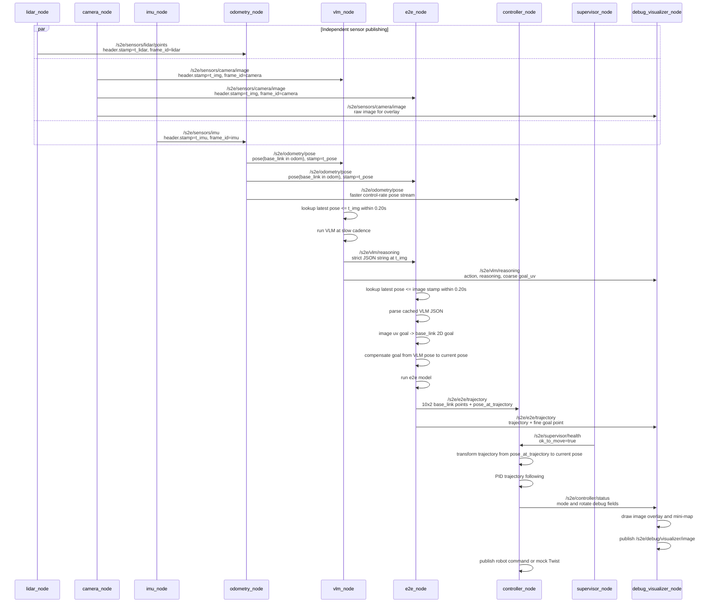
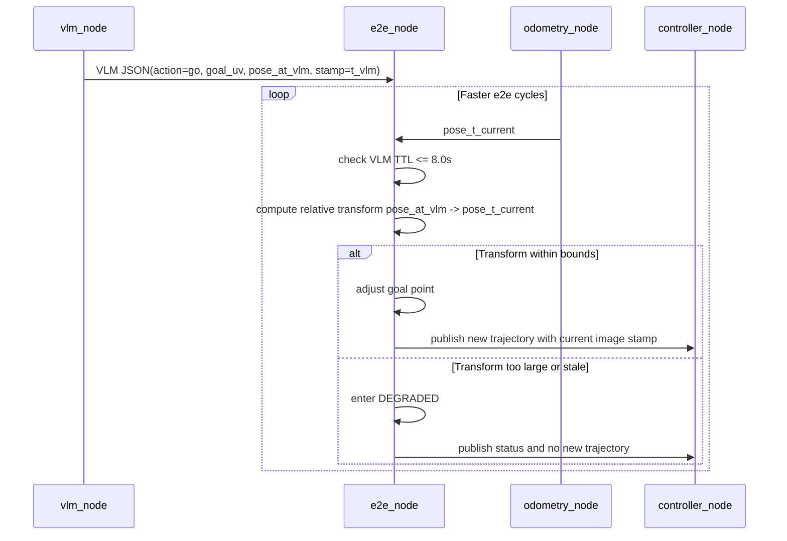
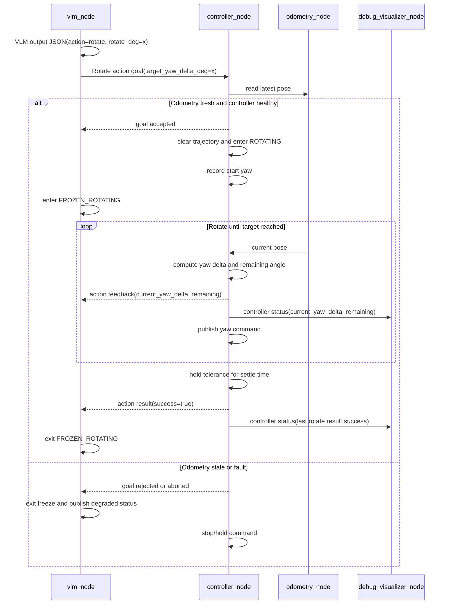
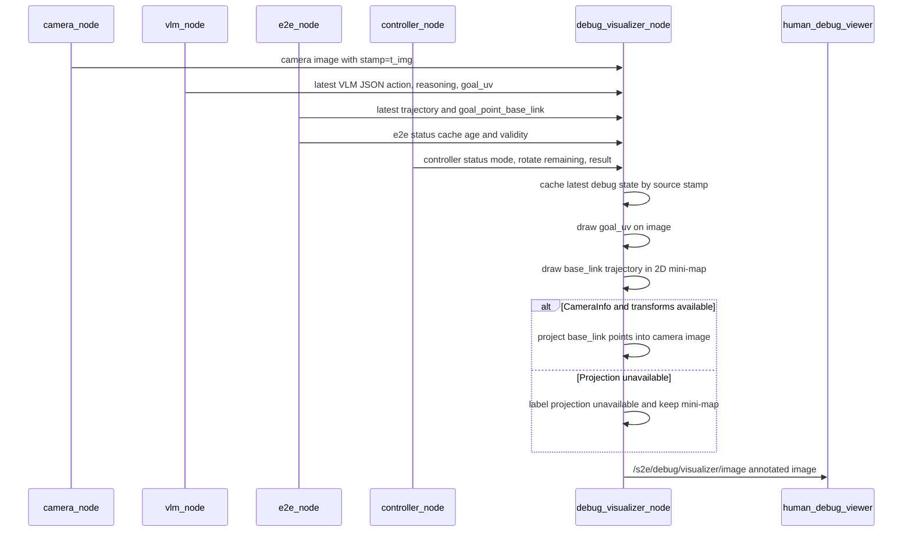
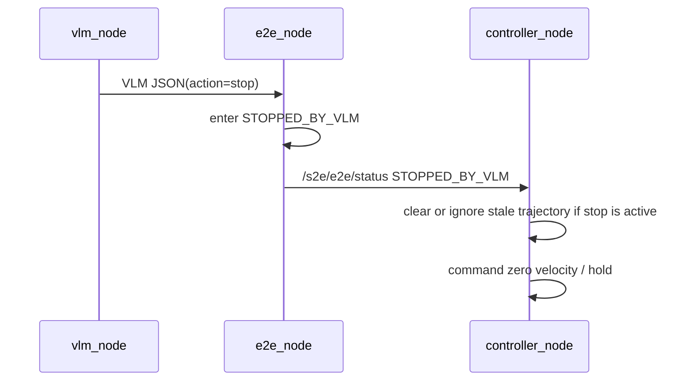
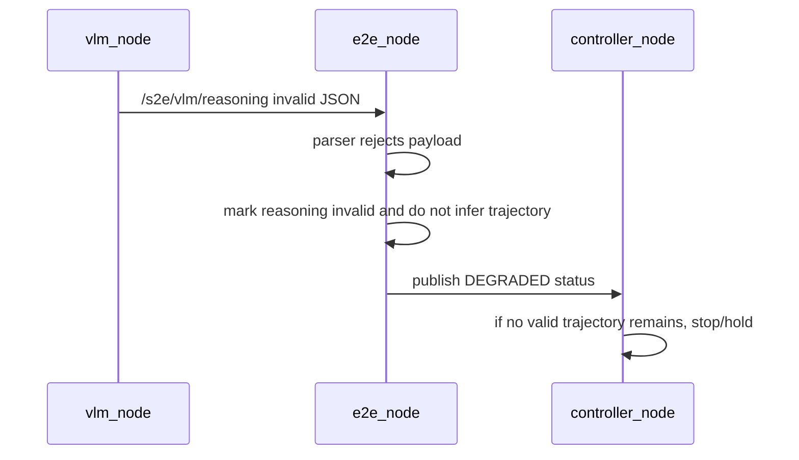
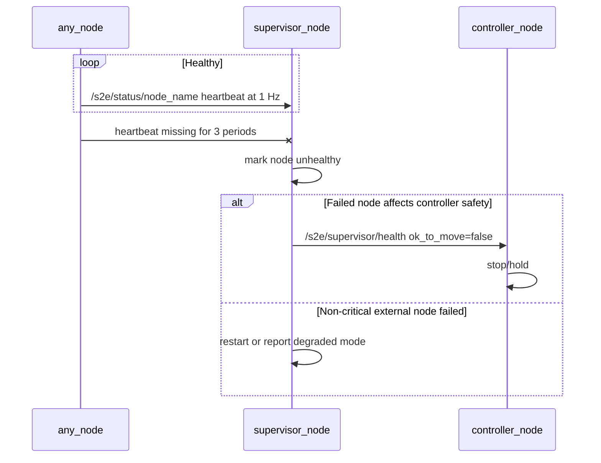
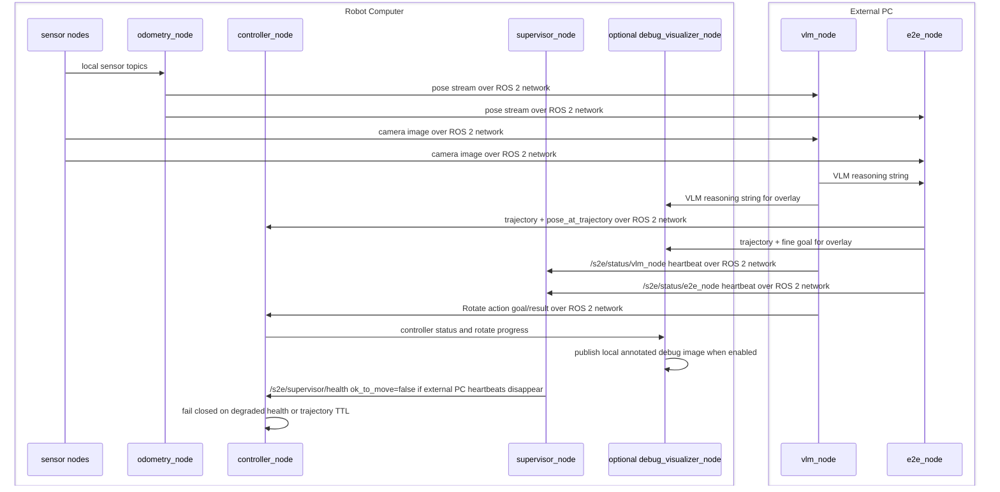

# Sequence Diagrams

These diagrams use Mermaid syntax and define required behavior for implementation and tests.

## Normal Async Sensor to Control Flow

## E2E Reusing Cached VLM Reasoning

## Rotate Action Flow

## Debug Visualizer Overlay Flow

## Stop Command Flow

## Malformed VLM String

## Watchdog Failure

## Robot/PC Split

